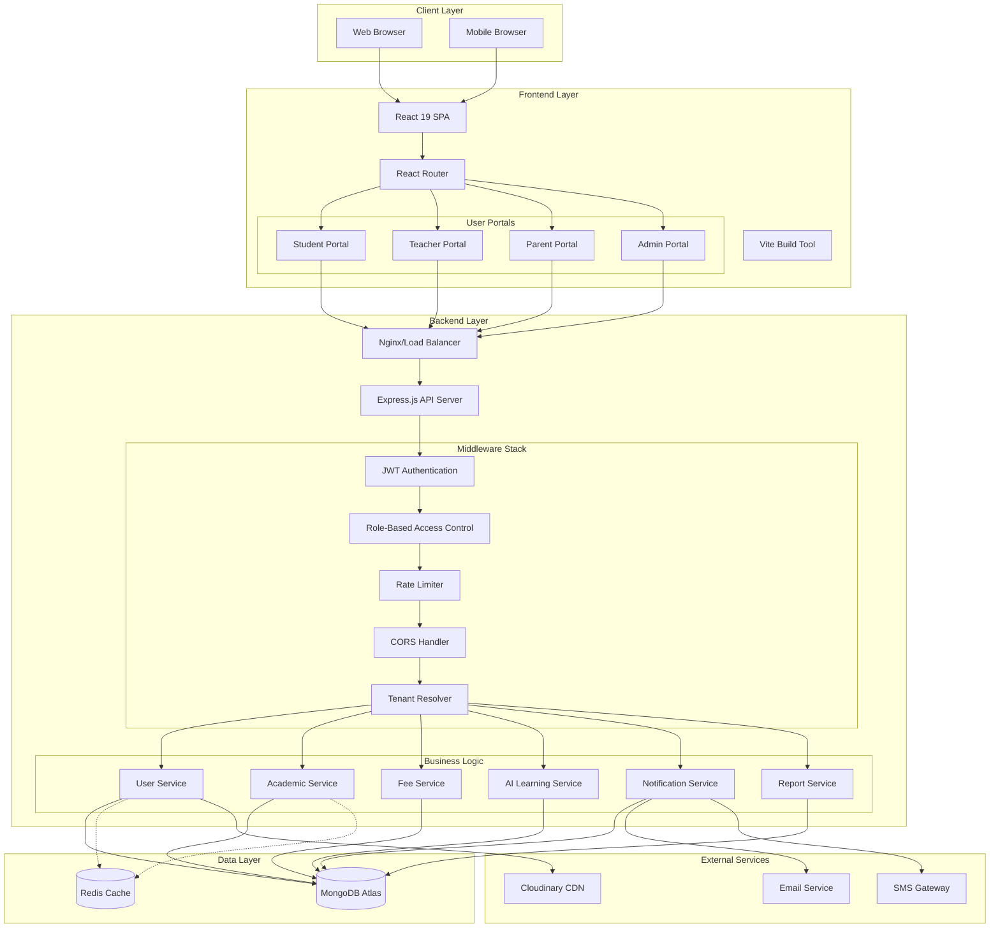
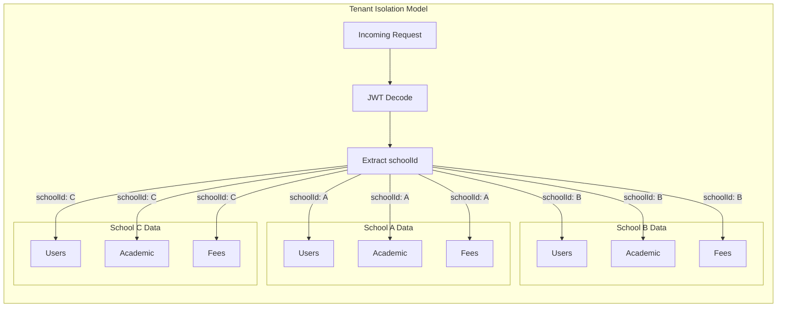
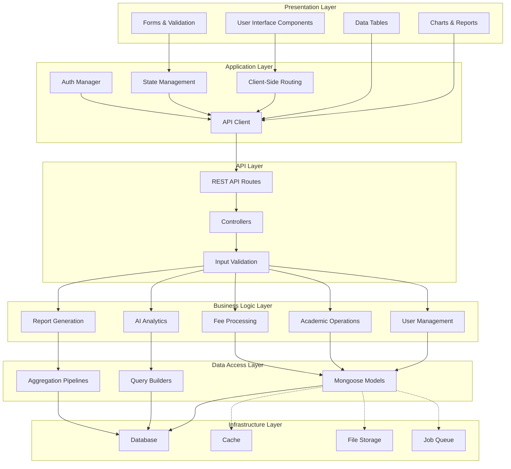
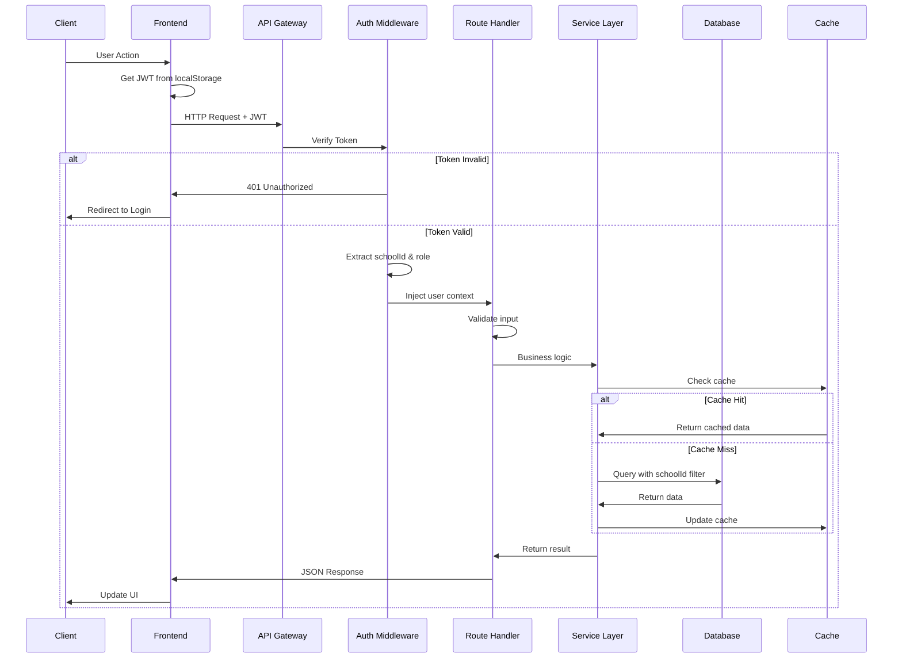
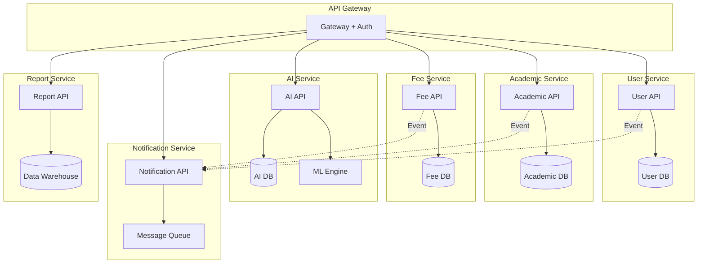
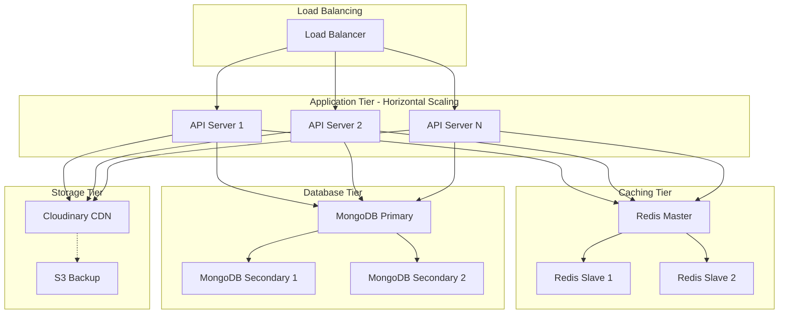

# System Architecture - EEC-NIF Multi-Tenant School Management System

## 1. High-Level System Overview



## 2. Multi-Tenant Architecture



### Tenant Isolation Strategy

**Approach:** Shared Database with Tenant Discriminator

**Implementation:**
- Every collection has `schoolId` field
- All queries filtered by `schoolId`
- JWT token contains `schoolId`
- Middleware injects `schoolId` into request context
- Database indexes on `schoolId` for performance

**Benefits:**
- Cost-effective (single database)
- Easy maintenance
- Simple backups
- Efficient resource utilization

**Security:**
- Tenant ID in JWT (tamper-proof)
- Query-level filtering
- Middleware enforcement
- No cross-tenant data leakage

## 3. Technology Stack

### Frontend Stack
```
┌─────────────────────────────────────┐
│         React 19.1.0                │
├─────────────────────────────────────┤
│  Routing: React Router DOM 7.6.2    │
│  Build: Vite 6.3.5                  │
│  Styling: Tailwind CSS 4.1.10       │
│  State: Context API + Local State   │
│  HTTP: Axios 1.13.2 + Fetch API     │
├─────────────────────────────────────┤
│  UI Libraries:                      │
│  - lucide-react (icons)             │
│  - sweetalert2 (alerts)             │
│  - react-hot-toast (notifications)  │
│  - Chart.js + Recharts (charts)     │
│  - jsPDF (PDF generation)           │
│  - XLSX (Excel export)              │
│  - Quill (rich text)                │
│  - Three.js (3D graphics)           │
└─────────────────────────────────────┘
```

### Backend Stack
```
┌─────────────────────────────────────┐
│      Node.js + Express 5.1.0        │
├─────────────────────────────────────┤
│  Database: MongoDB + Mongoose 8.15.1│
│  Auth: JWT (jsonwebtoken 9.0.2)     │
│  Password: bcryptjs 3.0.2           │
│  Files: Multer 2.0.2                │
│  Storage: Cloudinary 2.8.0          │
│  Security: CORS 2.8.5               │
│  Config: dotenv 16.5.0              │
│  Dev: nodemon 3.1.10                │
└─────────────────────────────────────┘
```

### Database Stack
```
┌─────────────────────────────────────┐
│        MongoDB Atlas                │
├─────────────────────────────────────┤
│  ODM: Mongoose 8.15.1               │
│  Features:                          │
│  - Schema validation                │
│  - Middleware hooks                 │
│  - Aggregation pipeline             │
│  - Indexes (unique, compound)       │
│  - Population (refs)                │
└─────────────────────────────────────┘
```

## 4. System Layers



## 5. Request Flow Architecture



## 6. Microservices-Ready Architecture

While currently monolithic, the system is structured for easy migration to microservices:



## 7. Scalability Architecture



## 8. Security Architecture

```mermaid
graph TB
    subgraph "Security Layers"
        subgraph "Perimeter Security"
            FIREWALL[Firewall]
            WAF[Web Application Firewall]
            DDoS[DDoS Protection]
        end

        subgraph "Application Security"
            HTTPS[HTTPS/TLS]
            CORS_SEC[CORS Policy]
            RATE_SEC[Rate Limiting]
            INPUT_VAL[Input Validation]
        end

        subgraph "Authentication Security"
            JWT_AUTH[JWT Authentication]
            PASSWORD_HASH[Password Hashing]
            PASSWORD_POLICY[Password Policy]
            SESSION_MGT[Session Management]
        end

        subgraph "Authorization Security"
            RBAC_SEC[Role-Based Access]
            TENANT_ISO[Tenant Isolation]
            API_PERM[API Permissions]
        end

        subgraph "Data Security"
            ENCRYPTION[Encryption at Rest]
            SECURE_CONN[Secure Connections]
            AUDIT_LOG[Audit Logging]
            BACKUP[Encrypted Backups]
        end
    end

    FIREWALL --> WAF
    WAF --> DDoS
    DDoS --> HTTPS
    HTTPS --> CORS_SEC
    CORS_SEC --> RATE_SEC
    RATE_SEC --> INPUT_VAL
    INPUT_VAL --> JWT_AUTH
    JWT_AUTH --> PASSWORD_HASH
    PASSWORD_HASH --> PASSWORD_POLICY
    PASSWORD_POLICY --> SESSION_MGT
    SESSION_MGT --> RBAC_SEC
    RBAC_SEC --> TENANT_ISO
    TENANT_ISO --> API_PERM
    API_PERM --> ENCRYPTION
    ENCRYPTION --> SECURE_CONN
    SECURE_CONN --> AUDIT_LOG
    AUDIT_LOG --> BACKUP
```



## 9. Key Architectural Decisions

### Decision 1: Multi-Tenant Strategy
**Choice:** Shared Database with Tenant Discriminator (schoolId)
**Rationale:**
- Cost-effective for small to medium scale
- Simple to maintain
- Easy backups and migrations
- Good performance with proper indexing

**Alternatives Considered:**
- Separate Database per Tenant: Too expensive, complex maintenance
- Schema-based Isolation: PostgreSQL-specific, migration complexity

### Decision 2: Monolithic Architecture
**Choice:** Monolithic with modular design
**Rationale:**
- Simpler deployment
- Lower operational overhead
- Faster development
- Sufficient for current scale

**Future Migration Path:**
- Modular code structure allows easy extraction to microservices
- Clear service boundaries defined

### Decision 3: JWT-Based Authentication
**Choice:** Stateless JWT tokens
**Rationale:**
- Scalable (no session store needed)
- Works well with load balancing
- Self-contained (contains user + tenant context)

**Trade-offs:**
- Cannot revoke tokens before expiry (mitigated with short expiry)
- Token size overhead (minimal impact)

### Decision 4: MongoDB Database
**Choice:** MongoDB with Mongoose ODM
**Rationale:**
- Flexible schema (rapid development)
- Good for hierarchical data (academic structure)
- Excellent aggregation framework (reports)
- Horizontal scaling capability

**Trade-offs:**
- No transactions across collections (acceptable for use case)
- Manual referential integrity

### Decision 5: React SPA
**Choice:** Single Page Application with React
**Rationale:**
- Rich interactive experience
- Fast client-side navigation
- Reusable components
- Large ecosystem

**Trade-offs:**
- Initial load time (mitigated with code splitting)
- SEO challenges (not critical for authenticated app)

## 10. Performance Characteristics

**Target Metrics:**
- API Response Time: < 200ms (p95)
- Page Load Time: < 2s
- Concurrent Users: 10,000+ per school
- Data Retention: 10+ years
- Uptime: 99.9%

**Optimization Strategies:**
- Database indexing on critical fields
- Redis caching for frequently accessed data
- Cloudinary CDN for static assets
- Aggregation pipelines for reports
- Lazy loading for large lists
- Code splitting for frontend

## 11. Architecture Evolution Roadmap

### Phase 1: Current (Monolithic)
- Single application server
- MongoDB database
- Basic caching

### Phase 2: Enhanced Monolith (6 months)
- Redis caching layer
- Database replication
- Horizontal scaling of API servers
- CDN for frontend assets

### Phase 3: Service Extraction (12 months)
- Extract notification service (async)
- Extract report service (CPU-intensive)
- Message queue introduction

### Phase 4: Microservices (18-24 months)
- Full service decomposition
- Event-driven architecture
- API gateway
- Service mesh

---

**Document Version:** 1.0
**Last Updated:** 2026-01-12
**Author:** System Architecture Team
