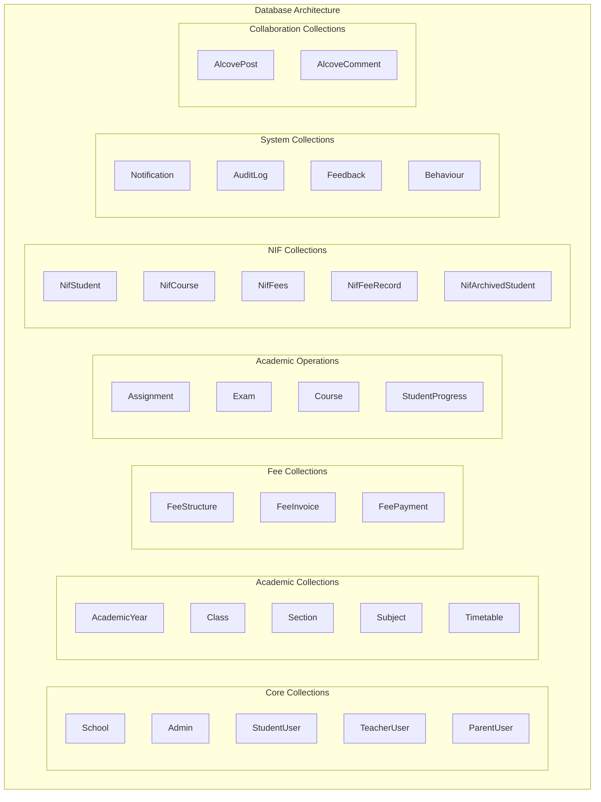
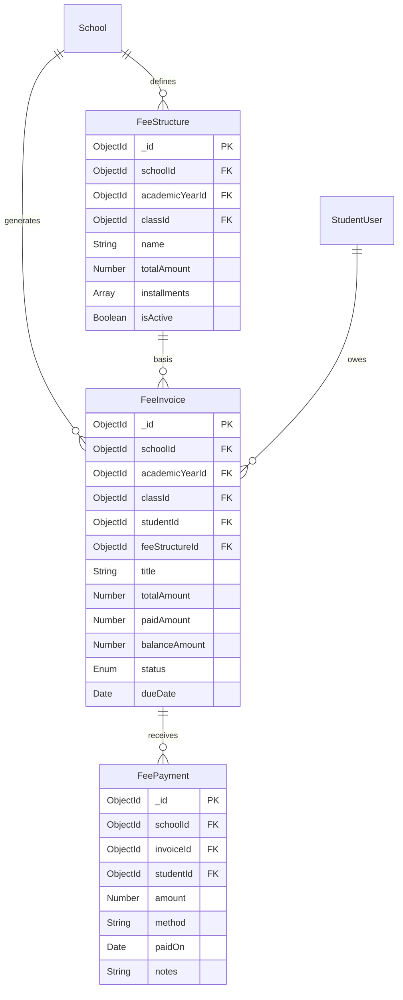
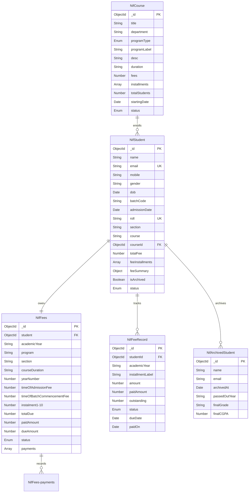
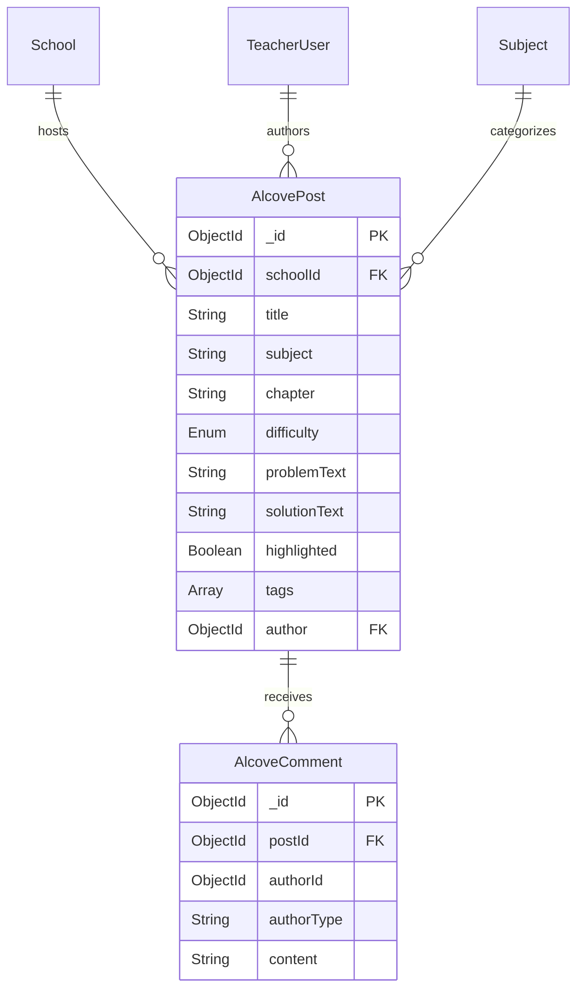
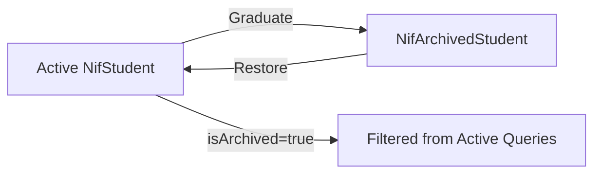

# Database Architecture - EEC-NIF System

## 1. Database Overview



## 2. Entity Relationship Diagram - Core Module

```mermaid
erDiagram
    School ||--o{ Admin : "manages"
    School ||--o{ StudentUser : "enrolls"
    School ||--o{ TeacherUser : "employs"
    School ||--o{ ParentUser : "registers"
    School ||--o{ AcademicYear : "configures"

    AcademicYear ||--o{ Class : "contains"
    Class ||--o{ Section : "divides"
    Class ||--o{ Subject : "teaches"

    School ||--o{ Notification : "broadcasts"
    School ||--o{ AuditLog : "tracks"

    StudentUser ||--o{ StudentUser-attendance : "embeds"

    School {
        ObjectId _id PK
        String name
        String code UK
        String address
        String contactEmail
        String contactPhone
        Enum status
        Date createdAt
        Date updatedAt
    }

    Admin {
        ObjectId _id PK
        String username UK
        String password
        String name
        ObjectId schoolId FK
    }

    StudentUser {
        ObjectId _id PK
        String username UK
        String password
        ObjectId schoolId FK
        String name
        String grade
        String section
        Number roll
        String gender
        String dob
        String mobile
        String email
        String address
        String profilePic
        Array attendance
    }

    TeacherUser {
        ObjectId _id PK
        String username UK
        String password
        ObjectId schoolId FK
        Number empId
        String name
        String email
        String mobile
        String subject
        String department
    }

    ParentUser {
        ObjectId _id PK
        String username UK
        String password
        ObjectId schoolId FK
        String name
        String mobile
        String email
        Array children
        Array grade
    }

    AcademicYear {
        ObjectId _id PK
        ObjectId schoolId FK
        String name
        Date startDate
        Date endDate
        Boolean isActive
    }

    Class {
        ObjectId _id PK
        ObjectId schoolId FK
        String name
        ObjectId academicYearId FK
        Number order
    }

    Section {
        ObjectId _id PK
        ObjectId schoolId FK
        ObjectId classId FK
        String name
    }

    Subject {
        ObjectId _id PK
        ObjectId schoolId FK
        ObjectId classId FK
        String name
        String code
    }
```

## 3. Entity Relationship Diagram - Fee Management



## 4. Entity Relationship Diagram - Academic Operations

```mermaid
erDiagram
    School ||--o{ Assignment : "creates"
    School ||--o{ Exam : "conducts"
    School ||--o{ Course : "offers"
    School ||--o{ Timetable : "schedules"
    StudentUser ||--|| StudentProgress : "tracks"

    Class ||--o{ Timetable : "has"
    Section ||--o{ Timetable : "has"
    Subject ||--o{ Timetable : "appears"
    TeacherUser ||--o{ Timetable : "teaches"

    StudentUser ||--o{ StudentProgress-submissions : "submits"
    Assignment ||--o{ StudentProgress-submissions : "receives"

    Assignment {
        ObjectId _id PK
        ObjectId schoolId FK
        String title
        String subject
        String class
        Number marks
        Enum status
        Date dueDate
    }

    Exam {
        ObjectId _id PK
        ObjectId schoolId FK
        String title
        String subject
        String instructor
        String venue
        String date
        String time
        Number duration
        Number marks
    }

    Course {
        ObjectId _id PK
        ObjectId schoolId FK
        String courseName
        String courseCode UK
        String description
        String duration
        Number credits
        String department
        String instructor
    }

    Timetable {
        ObjectId _id PK
        ObjectId schoolId FK
        ObjectId academicYearId FK
        ObjectId classId FK
        ObjectId sectionId FK
        Array entries
    }

    StudentProgress {
        ObjectId _id PK
        ObjectId schoolId FK
        ObjectId studentId FK
        Array submissions
        Array progressMetrics
        String overallGrade
        Number rank
        Array weaknessAnalysis
        Array aiLearningPaths
        Boolean needsIntervention
    }
```

## 5. Entity Relationship Diagram - NIF Module



## 6. Entity Relationship Diagram - Collaboration Module



## 7. Database Indexes

### Critical Indexes for Performance

```javascript
// Multi-Tenant Isolation
School: { code: 1 } (unique, sparse)
Admin: { username: 1 } (unique)
StudentUser: { username: 1 } (unique), { schoolId: 1 }
TeacherUser: { username: 1 } (unique), { schoolId: 1 }
ParentUser: { username: 1 } (unique), { schoolId: 1 }

// Academic Hierarchy
AcademicYear: { schoolId: 1, isActive: 1 }
Class: { schoolId: 1, academicYearId: 1 }
Section: { schoolId: 1, classId: 1 }
Subject: { schoolId: 1, classId: 1 }

// Fee Management
FeeStructure: { schoolId: 1, classId: 1 }
FeeInvoice: { schoolId: 1, studentId: 1, status: 1 }
FeePayment: { schoolId: 1, invoiceId: 1, studentId: 1 }

// Academic Operations
Assignment: { schoolId: 1, class: 1 }
Exam: { schoolId: 1, subject: 1 }
Course: { schoolId: 1 }, { courseCode: 1 } (unique)
Timetable: { schoolId: 1, classId: 1, sectionId: 1 }
StudentProgress: { schoolId: 1, studentId: 1 }, { 'progressMetrics.subject': 1 }

// NIF Module
NifCourse: { title: 1, department: 1 } (unique), { department: 1, status: 1 }
NifStudent: { roll: 1 }, { email: 1 }, { isArchived: 1 }
NifFees: { student: 1, academicYear: 1 }
NifFeeRecord: { studentId: 1, academicYear: 1 }

// Collaboration
AlcovePost: { schoolId: 1, subject: 1, difficulty: 1 }
AlcoveComment: { postId: 1 }

// System
Notification: { schoolId: 1, audience: 1 }
AuditLog: { schoolId: 1, actorId: 1 }
Behaviour: { schoolId: 1, studentClass: 1, subject: 1 }
```

### Compound Indexes

```javascript
// Optimized for common queries
{ schoolId: 1, status: 1 }
{ schoolId: 1, classId: 1, sectionId: 1 }
{ schoolId: 1, academicYearId: 1, isActive: 1 }
{ schoolId: 1, studentId: 1, status: 1 }
```

## 8. Data Storage Patterns

### Pattern 1: Embedded Documents (One-to-Few)

**Usage:** StudentUser.attendance[]

```javascript
{
  _id: ObjectId,
  username: "john_doe",
  // ... other fields
  attendance: [
    { date: ISODate("2026-01-10"), status: "present", subject: "Math" },
    { date: ISODate("2026-01-11"), status: "absent", subject: "Science" }
  ]
}
```

**Rationale:**
- Tight coupling (attendance belongs to student)
- Small array size
- Frequently accessed together
- Atomic updates

### Pattern 2: Referenced Documents (One-to-Many)

**Usage:** FeeInvoice → StudentUser

```javascript
// FeeInvoice
{
  _id: ObjectId,
  studentId: ObjectId("student123"),
  totalAmount: 10000,
  // ... other fields
}

// Query with population
FeeInvoice.findById(id).populate('studentId')
```

**Rationale:**
- Normalized data
- Student data used independently
- Avoid duplication
- Flexible querying

### Pattern 3: Array of References (Many-to-Many)

**Usage:** ParentUser.children[]

```javascript
{
  _id: ObjectId,
  username: "parent_123",
  children: ["student_1", "student_2", "student_3"],
  // ... other fields
}
```

**Rationale:**
- Multiple children per parent
- Children exist independently
- Simple lookup

### Pattern 4: Pre-computed Aggregates

**Usage:** NifStudent.feeSummary

```javascript
{
  _id: ObjectId,
  name: "Student Name",
  feeSummary: {
    totalFee: 155000,
    paidAmount: 50000,
    dueAmount: 105000,
    status: "partial"
  },
  // Pre-computed in pre-save hook
}
```

**Rationale:**
- Avoid expensive joins
- Fast dashboard queries
- Consistency via hooks

## 9. Data Integrity Rules

### Referential Integrity

**Foreign Key Constraints (Application-Level):**
```javascript
// Before deleting a School, check:
- No Admin with schoolId
- No StudentUser with schoolId
- No TeacherUser with schoolId
- No Academic data with schoolId

// Before deleting a Class, check:
- No Section with classId
- No Subject with classId
- No Timetable with classId
```

### Uniqueness Constraints

```javascript
// Unique across system
Admin.username
StudentUser.username
TeacherUser.username
ParentUser.username
Course.courseCode
School.code (sparse)

// Unique per tenant
NifStudent.roll (within school)
NifStudent.email (within school)
NifCourse.title + department (compound unique)
```

### Validation Rules

```javascript
// Password Policy (enforced in middleware)
- Minimum 8 characters
- At least 1 uppercase letter
- At least 1 lowercase letter
- At least 1 number

// Fee Rules (enforced in pre-save hooks)
- paidAmount <= totalAmount
- balanceAmount = totalAmount - paidAmount
- status = 'due' if paidAmount = 0
- status = 'partial' if 0 < paidAmount < totalAmount
- status = 'paid' if paidAmount = totalAmount

// Academic Rules (enforced in controllers)
- Section must belong to a Class
- Subject can be class-specific or school-wide
- AcademicYear: Only one isActive per school
```

## 10. Data Migration Strategy

### Schema Versioning

```javascript
// Each model includes schema version
{
  _id: ObjectId,
  schemaVersion: 1.0,
  // ... fields
}
```

### Migration Scripts

```javascript
// Example: Add new field to all students
db.studentusers.updateMany(
  { profilePic: { $exists: false } },
  { $set: { profilePic: null } }
)

// Example: Rename field
db.studentusers.updateMany(
  {},
  { $rename: { "oldFieldName": "newFieldName" } }
)
```

### Backward Compatibility

```javascript
// Handle old and new schemas
const student = await StudentUser.findById(id);
const profilePic = student.profilePic || student.profile_pic || null;
```

## 11. Data Archival Strategy

### NIF Student Archival



**Implementation:**
```javascript
// Archive student
const archivedData = {
  ...student.toObject(),
  archivedAt: new Date(),
  passedOutYear: "2026"
};
await NifArchivedStudent.create(archivedData);
await NifStudent.updateOne(
  { _id: student._id },
  { isArchived: true, archivedAt: new Date() }
);

// Query active students only
NifStudent.find({ isArchived: { $ne: true } })
```

## 12. Backup and Recovery

### Backup Strategy

```yaml
Strategy: Automated Daily Backups

Full Backup:
  - Frequency: Daily at 2:00 AM UTC
  - Retention: 30 days
  - Storage: MongoDB Atlas Backup + S3

Incremental Backup:
  - Frequency: Every 6 hours
  - Retention: 7 days
  - Storage: MongoDB Oplog

Point-in-Time Recovery:
  - Available: Last 7 days
  - Granularity: 1 second
```

### Recovery Procedures

```javascript
// Restore full database
mongorestore --uri="mongodb+srv://..." --archive=backup.archive

// Restore specific collection
mongorestore --uri="mongodb+srv://..." --nsInclude="eec_nif.studentusers" --archive=backup.archive

// Point-in-time recovery (Atlas)
// Use Atlas UI to select timestamp and restore
```

## 13. Database Performance Tuning

### Query Optimization

```javascript
// Bad: Full collection scan
StudentUser.find({ name: "John" })

// Good: Use indexed field
StudentUser.find({ username: "john_doe" })

// Bad: Multiple queries
const students = await StudentUser.find({ schoolId });
for (let student of students) {
  const fees = await FeeInvoice.find({ studentId: student._id });
}

// Good: Use aggregation
const results = await StudentUser.aggregate([
  { $match: { schoolId: ObjectId(schoolId) } },
  { $lookup: {
      from: "feeinvoices",
      localField: "_id",
      foreignField: "studentId",
      as: "fees"
    }
  }
]);
```

### Indexing Best Practices

```javascript
// Use compound indexes for common queries
db.studentusers.createIndex({ schoolId: 1, grade: 1, section: 1 })

// Use sparse indexes for optional fields
db.schools.createIndex({ code: 1 }, { unique: true, sparse: true })

// Use partial indexes for filtered queries
db.nifstudents.createIndex(
  { roll: 1 },
  { partialFilterExpression: { isArchived: { $ne: true } } }
)
```

### Connection Pooling

```javascript
mongoose.connect(process.env.MONGODB_URL, {
  maxPoolSize: 10,
  minPoolSize: 2,
  socketTimeoutMS: 45000,
  serverSelectionTimeoutMS: 5000
});
```

## 14. Data Volume Estimates

### Current Data Model Sizing

```
Average Document Sizes:
- School: 500 bytes
- Admin: 300 bytes
- StudentUser: 2 KB (with 100 attendance records)
- TeacherUser: 1 KB
- ParentUser: 500 bytes
- AcademicYear: 200 bytes
- Class: 200 bytes
- Section: 200 bytes
- Subject: 300 bytes
- FeeStructure: 1 KB
- FeeInvoice: 500 bytes
- FeePayment: 300 bytes
- Timetable: 3 KB (with 50 entries)
- Notification: 500 bytes
- AuditLog: 400 bytes
- Assignment: 800 bytes
- Exam: 600 bytes
- Course: 1 KB
- StudentProgress: 5 KB (with AI data)
- NifStudent: 2 KB
- NifCourse: 1.5 KB
- NifFees: 3 KB (with payments array)
- AlcovePost: 3 KB
- AlcoveComment: 300 bytes
```

### Projected Growth (Per School, 1000 Students)

```
Year 1:
- Students: 1000 × 2 KB = 2 MB
- Teachers: 50 × 1 KB = 50 KB
- Parents: 800 × 500 bytes = 400 KB
- Attendance (per year): 1000 × 200 days × 50 bytes = 10 MB
- Fee Invoices: 1000 × 3 invoices × 500 bytes = 1.5 MB
- Fee Payments: 3000 × 300 bytes = 900 KB
- Timetables: 30 classes × 3 KB = 90 KB
- Assignments: 500 × 800 bytes = 400 KB
- Exams: 200 × 600 bytes = 120 KB
- Notifications: 365 × 500 bytes = 183 KB
- Audit Logs: 10000 × 400 bytes = 4 MB
- Total: ~20 MB per school per year

100 Schools: 2 GB/year
1000 Schools: 20 GB/year
```

---

**Document Version:** 1.0
**Last Updated:** 2026-01-12
**Author:** Database Architecture Team
