# Component Architecture - EEC-NIF System

## 1. Backend Component Architecture

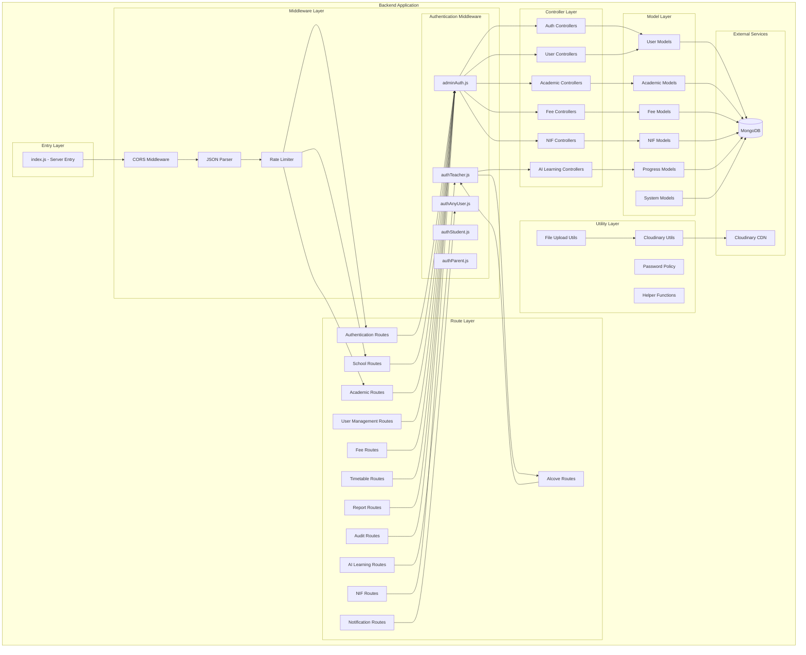

## 2. Backend Module Breakdown

### 2.1 Authentication Module

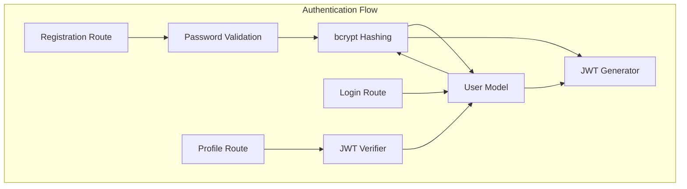

**Components:**
- **Routes:** `/routes/adminAuth.js`, `/routes/teacherAuth.js`, `/routes/studentAuth.js`, `/routes/parentAuth.js`
- **Middleware:** `/middleware/adminAuth.js`, `/middleware/authTeacher.js`, etc.
- **Models:** `Admin`, `TeacherUser`, `StudentUser`, `ParentUser`
- **Utils:** `/utils/passwordPolicy.js`

**Responsibilities:**
- User registration with password policy enforcement
- User login with rate limiting
- JWT token generation and verification
- Role-based authentication

### 2.2 Academic Module

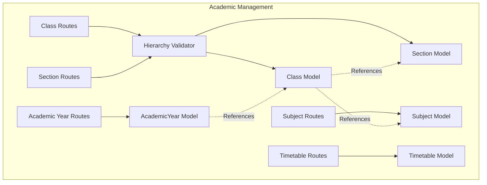

**Components:**
- **Routes:** `/routes/academicRoutes.js`
- **Models:** `AcademicYear`, `Class`, `Section`, `Subject`, `Timetable`

**Responsibilities:**
- Academic year configuration
- Class/Section hierarchy management
- Subject assignment
- Timetable scheduling

### 2.3 Fee Management Module

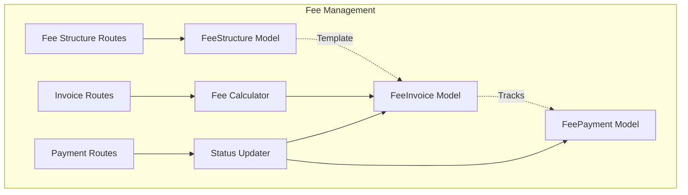

**Components:**
- **Routes:** `/routes/feeRoutes.js`
- **Models:** `FeeStructure`, `FeeInvoice`, `FeePayment`

**Responsibilities:**
- Fee structure definition
- Invoice generation
- Payment processing
- Status tracking (due/partial/paid)

### 2.4 User Management Module

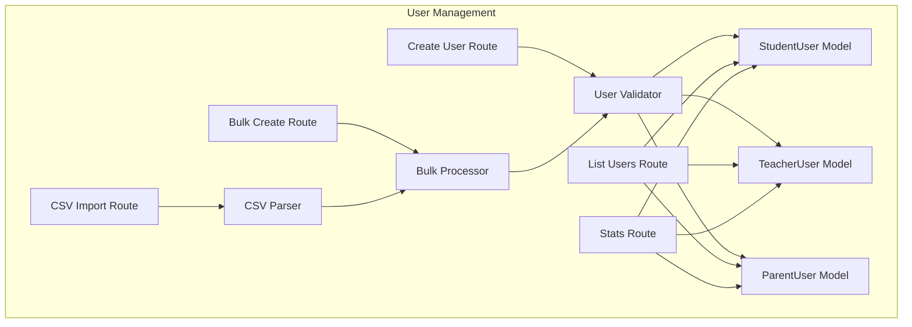

**Components:**
- **Routes:** `/routes/adminUserRoutes.js`
- **Models:** `StudentUser`, `TeacherUser`, `ParentUser`
- **Utils:** Custom CSV parser

**Responsibilities:**
- Single user creation
- Bulk user creation
- CSV import with error reporting
- User listing with filters
- Dashboard statistics

### 2.5 AI Learning Module

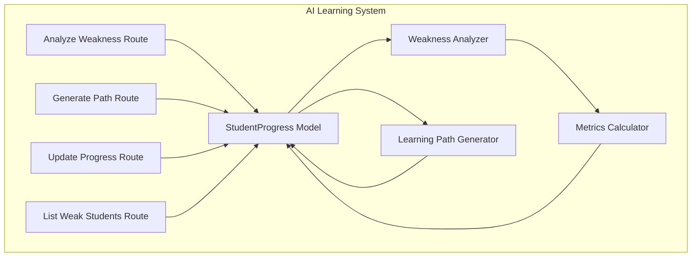

**Components:**
- **Routes:** `/routes/aiLearningRoutes.js`
- **Models:** `StudentProgress`, `Assignment`, `Behaviour`

**Responsibilities:**
- Weakness analysis
- Learning path generation
- Progress tracking
- Intervention detection
- Resource recommendation

### 2.6 NIF Module

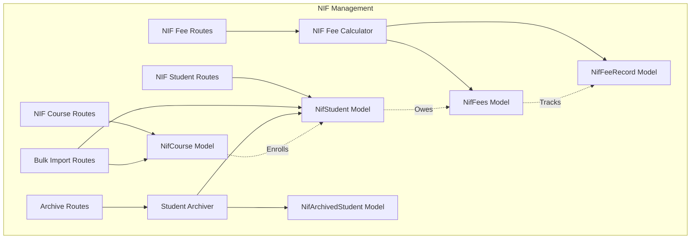

**Components:**
- **Routes:** `/routes/nifRoutes.js`
- **Models:** `NifStudent`, `NifCourse`, `NifFees`, `NifFeeRecord`, `NifArchivedStudent`

**Responsibilities:**
- NIF student management
- Course management (ADV_CERT, B_VOC, M_VOC, B_DES)
- Fee calculation and tracking
- Installment management
- Student archival (graduation)

### 2.7 Notification & Audit Module

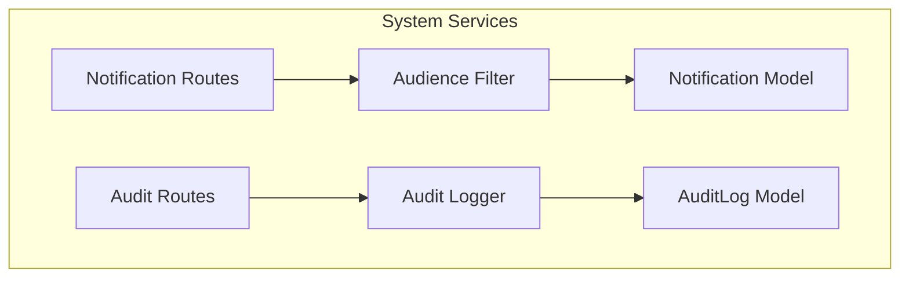

**Components:**
- **Routes:** `/routes/notificationRoutes.js`, `/routes/auditLogRoutes.js`
- **Models:** `Notification`, `AuditLog`

**Responsibilities:**
- Broadcast notifications
- Audience targeting
- Audit log creation
- Compliance tracking

## 3. Frontend Component Architecture

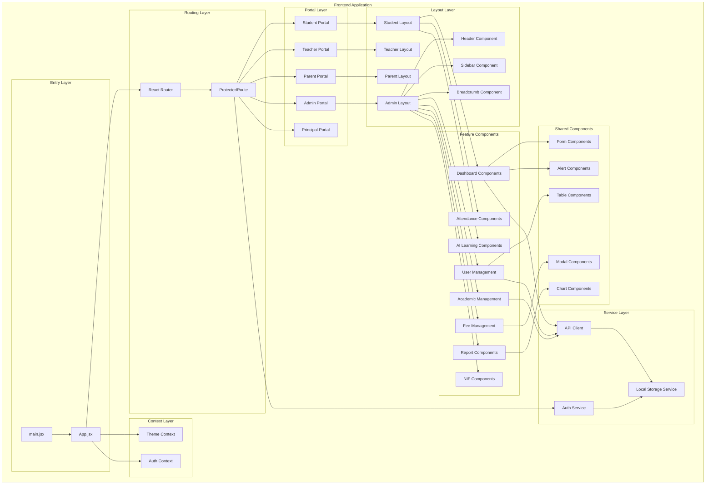

## 4. Frontend Module Breakdown

### 4.1 Authentication Module

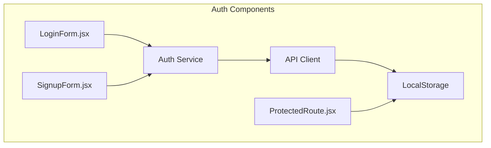

**Components:**
- `LoginForm.jsx` - Multi-role login
- `SignupForm.jsx` - User registration
- `ProtectedRoute.jsx` - Route guard

**Responsibilities:**
- User login/logout
- Token management
- Role-based routing
- Session persistence

### 4.2 Student Portal Module

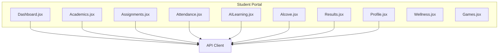

**Key Features:**
- Personal dashboard with stats
- Academic progress tracking
- Assignment submission
- Attendance marking
- AI-powered learning paths
- Academic collaboration (Alcove)
- Wellness tracking
- Educational games

### 4.3 Admin Portal Module

```mermaid
graph TB
    subgraph "Admin Portal"
        ADMIN_DASH[Dashboard.jsx]
        USERS[User Management]
        ACADEMIC[Academic Setup]
        FEES[Fee Management]
        ATTENDANCE_MGMT[Attendance Management]
        REPORTS[Reports & Analytics]
        TIMETABLE[Timetable Management]
        NOTIFICATIONS[Notifications]
        NIF[NIF Management]
    end

    subgraph "User Management"
        STUDENTS[Students.jsx]
        TEACHERS[Teachers.jsx]
        PARENTS[Parents.jsx]
        STAFF[Staff.jsx]
        BULK_UPLOAD[BulkUpload.jsx]
    end

    subgraph "Academic Setup"
        YEARS[AcademicYears.jsx]
        CLASSES[Classes.jsx]
        SECTIONS[Sections.jsx]
        SUBJECTS[Subjects.jsx]
    end

    subgraph "Fee Management"
        FEE_DASH[FeeDashboard.jsx]
        FEE_STRUCTURE[FeeStructure.jsx]
        FEE_COLLECTION[FeeCollection.jsx]
        FEE_REPORTS[FeeReports.jsx]
    end

    ADMIN_DASH --> API_CLIENT[API Client]
    USERS --> STUDENTS
    USERS --> TEACHERS
    USERS --> PARENTS
    USERS --> BULK_UPLOAD

    STUDENTS --> API_CLIENT
    TEACHERS --> API_CLIENT
    BULK_UPLOAD --> API_CLIENT

    ACADEMIC --> YEARS
    ACADEMIC --> CLASSES
    ACADEMIC --> SECTIONS

    YEARS --> API_CLIENT
    CLASSES --> API_CLIENT

    FEES --> FEE_DASH
    FEES --> FEE_STRUCTURE
    FEES --> FEE_COLLECTION

    FEE_DASH --> API_CLIENT
    FEE_STRUCTURE --> API_CLIENT
```

**Key Features:**
- Comprehensive dashboard
- User management (CRUD + bulk import)
- Academic configuration
- Fee management
- Attendance monitoring
- Report generation
- Timetable creation
- Notification broadcasting
- NIF-specific management

### 4.4 Teacher Portal Module

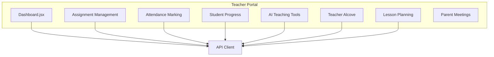

**Key Features:**
- Teacher dashboard
- Assignment creation & evaluation
- Attendance marking
- Student progress tracking
- AI-powered teaching recommendations
- Academic collaboration (Alcove)
- Lesson plan management
- Parent communication

### 4.5 Parent Portal Module

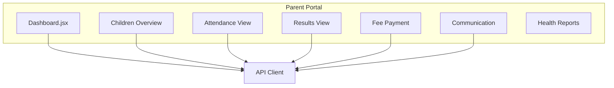

**Key Features:**
- Parent dashboard
- Multiple children tracking
- Attendance monitoring
- Academic performance view
- Fee payment
- Teacher communication
- Health reports

### 4.6 Shared Component Library

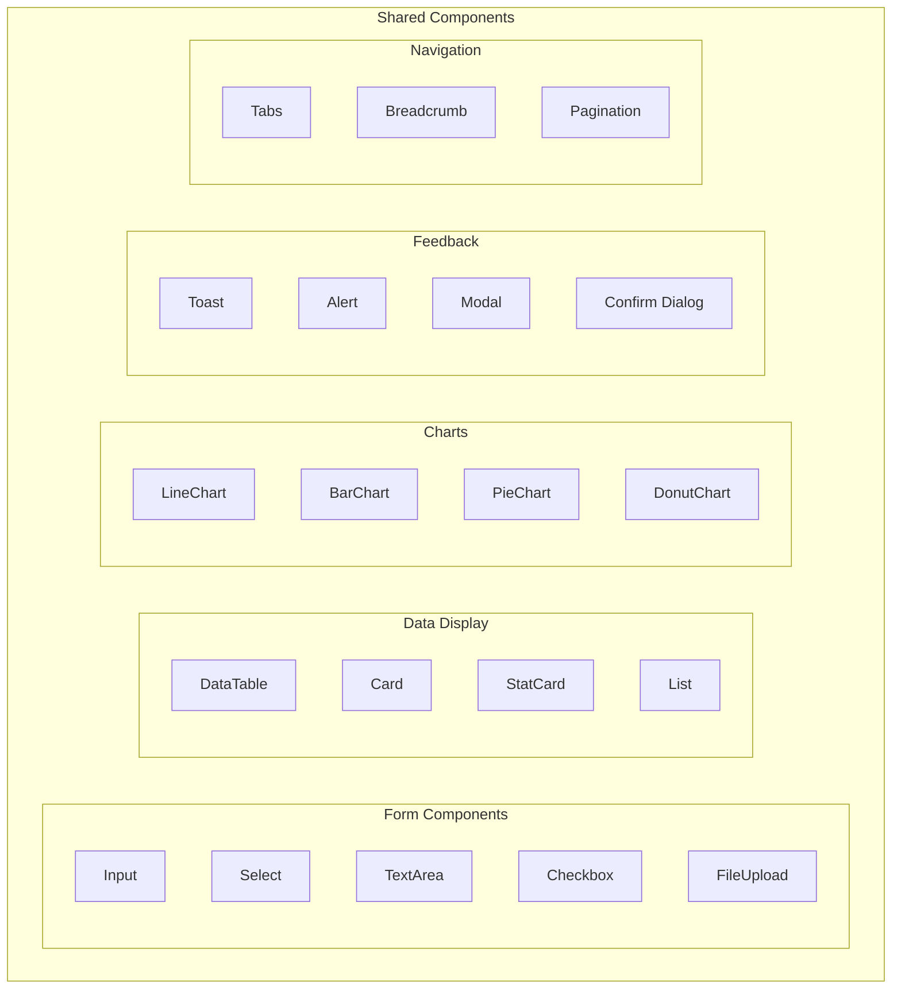

**Component Library:**
- Form controls with validation
- Data tables with sorting/filtering
- Chart components (Chart.js + Recharts)
- Notification system (toast/alert)
- Modal dialogs
- Navigation components

## 5. State Management Architecture

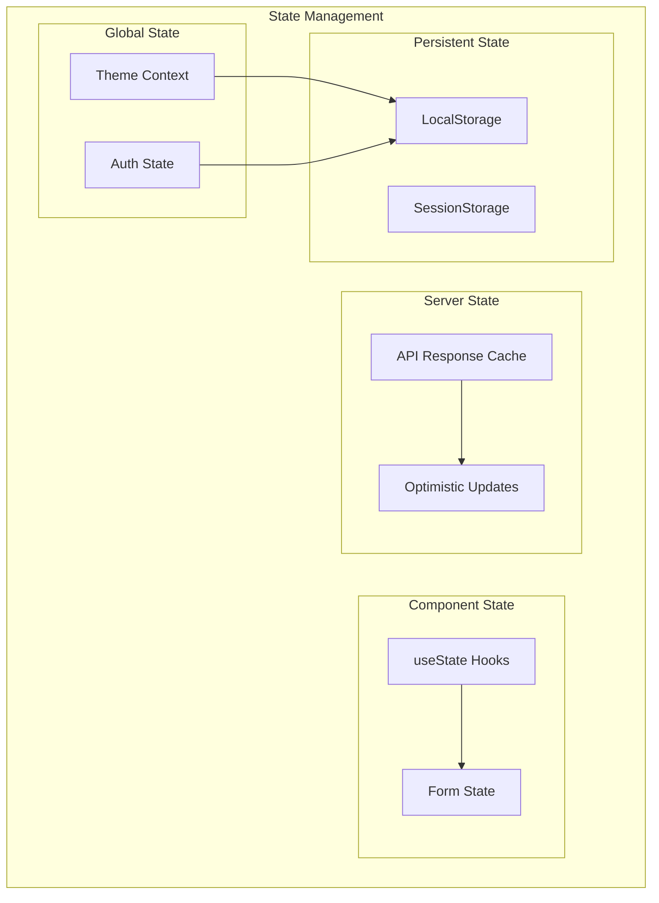

**State Strategy:**
- **Global State:** Context API for theme and auth
- **Component State:** useState hooks for local state
- **Server State:** Direct API calls, no global cache (future: React Query)
- **Persistent State:** LocalStorage for token, userType, theme

## 6. API Client Architecture

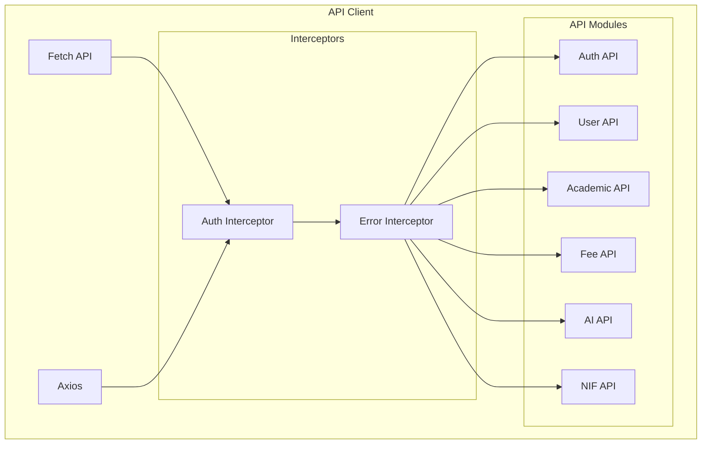

**API Client Pattern:**
```javascript
// Common pattern used
const response = await fetch(`${API_URL}/api/endpoint`, {
  method: 'POST',
  headers: {
    'Content-Type': 'application/json',
    'Authorization': `Bearer ${localStorage.getItem('token')}`
  },
  body: JSON.stringify(data)
});

const result = await response.json();

if (!response.ok) {
  toast.error(result.error || 'Operation failed');
  return;
}

toast.success('Operation successful');
```

## 7. File Upload Architecture

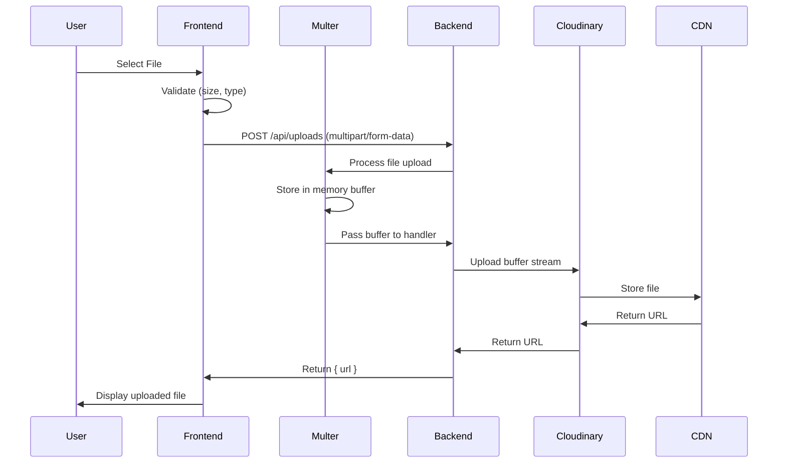

**Components:**
- **Frontend:** File input, preview
- **Backend:** Multer middleware (memory storage)
- **Utility:** `uploadBufferToCloudinary` (stream-based)
- **Storage:** Cloudinary CDN

## 8. Component Communication Patterns

### Pattern 1: Parent-Child Props

```jsx
// Parent
<StudentTable students={students} onEdit={handleEdit} />

// Child
function StudentTable({ students, onEdit }) {
  return (
    <table>
      {students.map(s => (
        <tr key={s._id}>
          <td>{s.name}</td>
          <td><button onClick={() => onEdit(s)}>Edit</button></td>
        </tr>
      ))}
    </table>
  );
}
```

### Pattern 2: Context API

```jsx
// Context Provider
<ThemeContext.Provider value={{ theme, setTheme }}>
  <App />
</ThemeContext.Provider>

// Consumer
const { theme } = useContext(ThemeContext);
```

### Pattern 3: Event Emitter (Custom Events)

```jsx
// Emit
window.dispatchEvent(new CustomEvent('userUpdated', { detail: user }));

// Listen
useEffect(() => {
  const handler = (e) => console.log(e.detail);
  window.addEventListener('userUpdated', handler);
  return () => window.removeEventListener('userUpdated', handler);
}, []);
```

## 9. Error Handling Architecture

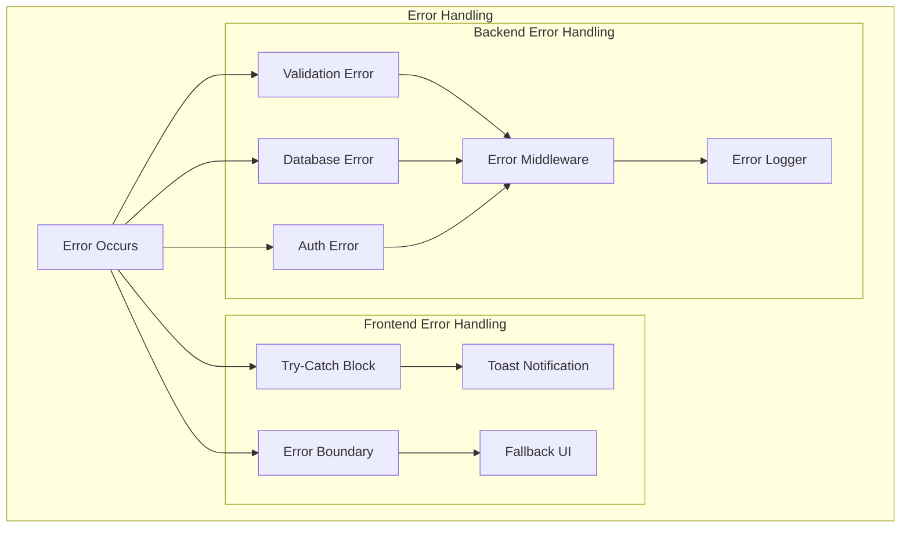

**Error Handling Strategy:**
- **Frontend:** Try-catch + toast notifications
- **Backend:** Centralized error middleware
- **Validation:** Schema validation + custom validators
- **Logging:** Console logs (future: structured logging)

## 10. Component Lifecycle

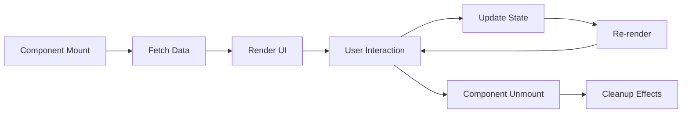

**Lifecycle Pattern:**
```jsx
function Component() {
  const [data, setData] = useState([]);

  // Mount: Fetch data
  useEffect(() => {
    fetchData();
  }, []);

  // Interaction: Handle events
  const handleAction = async () => {
    await apiCall();
    fetchData(); // Re-fetch
  };

  // Unmount: Cleanup
  useEffect(() => {
    return () => {
      // Cleanup
    };
  }, []);

  return <UI data={data} onAction={handleAction} />;
}
```

---

**Document Version:** 1.0
**Last Updated:** 2026-01-12
**Author:** Component Architecture Team
