# Sequence Diagrams - Key System Flows

## 1. User Registration Flow

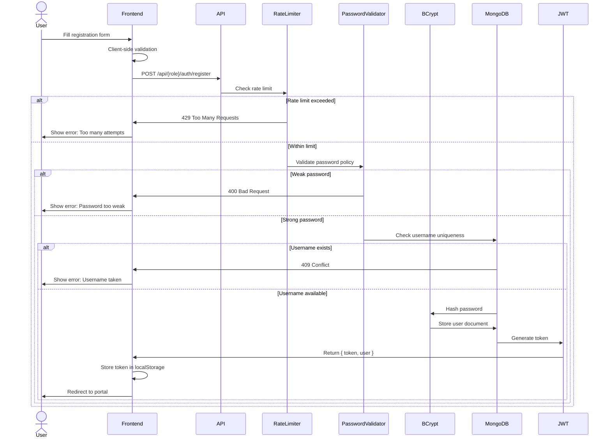
```mermaid
sequenceDiagram
    actor User
    participant Frontend
    participant API
    participant RateLimiter
    participant PasswordValidator
    participant BCrypt
    participant MongoDB
    participant JWT

    User->>Frontend: Fill registration form
    Frontend->>Frontend: Client-side validation
    Frontend->>API: POST /api/{role}/auth/register
    API->>RateLimiter: Check rate limit
    alt Rate limit exceeded
        RateLimiter->>Frontend: 429 Too Many Requests
        Frontend->>User: Show error: Too many attempts
    else Within limit
        RateLimiter->>PasswordValidator: Validate password policy
        alt Weak password
            PasswordValidator->>Frontend: 400 Bad Request
            Frontend->>User: Show error: Password too weak
        else Strong password
            PasswordValidator->>MongoDB: Check username uniqueness
            alt Username exists
                MongoDB->>Frontend: 409 Conflict
                Frontend->>User: Show error: Username taken
            else Username available
                MongoDB->>BCrypt: Hash password
                BCrypt->>MongoDB: Store user document
                MongoDB->>JWT: Generate token
                JWT->>Frontend: Return { token, user }
                Frontend->>Frontend: Store token in localStorage
                Frontend->>User: Redirect to portal
            end
        end
    end
```

## 2. User Login Flow

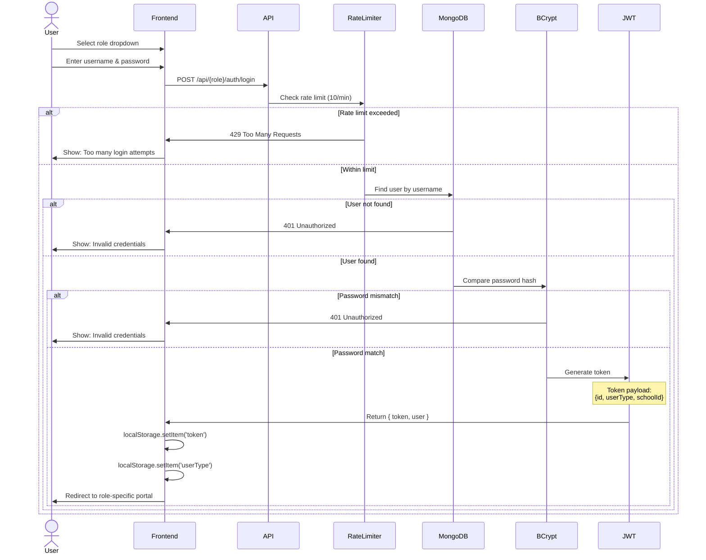
```mermaid
sequenceDiagram
    actor User
    participant Frontend
    participant API
    participant RateLimiter
    participant MongoDB
    participant BCrypt
    participant JWT

    User->>Frontend: Select role dropdown
    User->>Frontend: Enter username & password
    Frontend->>API: POST /api/{role}/auth/login
    API->>RateLimiter: Check rate limit (10/min)
    alt Rate limit exceeded
        RateLimiter->>Frontend: 429 Too Many Requests
        Frontend->>User: Show: Too many login attempts
    else Within limit
        RateLimiter->>MongoDB: Find user by username
        alt User not found
            MongoDB->>Frontend: 401 Unauthorized
            Frontend->>User: Show: Invalid credentials
        else User found
            MongoDB->>BCrypt: Compare password hash
            alt Password mismatch
                BCrypt->>Frontend: 401 Unauthorized
                Frontend->>User: Show: Invalid credentials
            else Password match
                BCrypt->>JWT: Generate token
                Note over JWT: Token payload:<br/>{id, userType, schoolId}
                JWT->>Frontend: Return { token, user }
                Frontend->>Frontend: localStorage.setItem('token')
                Frontend->>Frontend: localStorage.setItem('userType')
                Frontend->>User: Redirect to role-specific portal
            end
        end
    end
```

## 3. Authenticated Request Flow

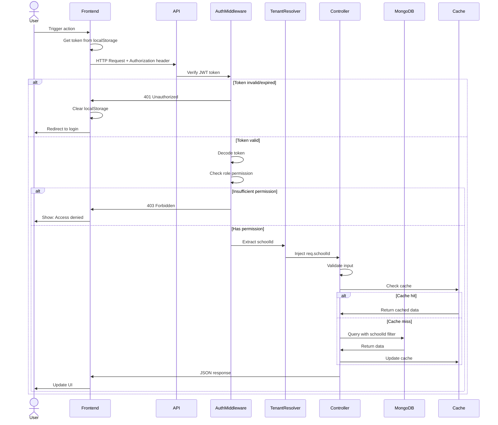
```mermaid
sequenceDiagram
    actor User
    participant Frontend
    participant API
    participant AuthMiddleware
    participant TenantResolver
    participant Controller
    participant MongoDB
    participant Cache

    User->>Frontend: Trigger action
    Frontend->>Frontend: Get token from localStorage
    Frontend->>API: HTTP Request + Authorization header
    API->>AuthMiddleware: Verify JWT token
    alt Token invalid/expired
        AuthMiddleware->>Frontend: 401 Unauthorized
        Frontend->>Frontend: Clear localStorage
        Frontend->>User: Redirect to login
    else Token valid
        AuthMiddleware->>AuthMiddleware: Decode token
        AuthMiddleware->>AuthMiddleware: Check role permission
        alt Insufficient permission
            AuthMiddleware->>Frontend: 403 Forbidden
            Frontend->>User: Show: Access denied
        else Has permission
            AuthMiddleware->>TenantResolver: Extract schoolId
            TenantResolver->>Controller: Inject req.schoolId
            Controller->>Controller: Validate input
            Controller->>Cache: Check cache
            alt Cache hit
                Cache->>Controller: Return cached data
            else Cache miss
                Controller->>MongoDB: Query with schoolId filter
                MongoDB->>Controller: Return data
                Controller->>Cache: Update cache
            end
            Controller->>Frontend: JSON response
            Frontend->>User: Update UI
        end
    end
```

## 4. Multi-Tenant Data Access Flow

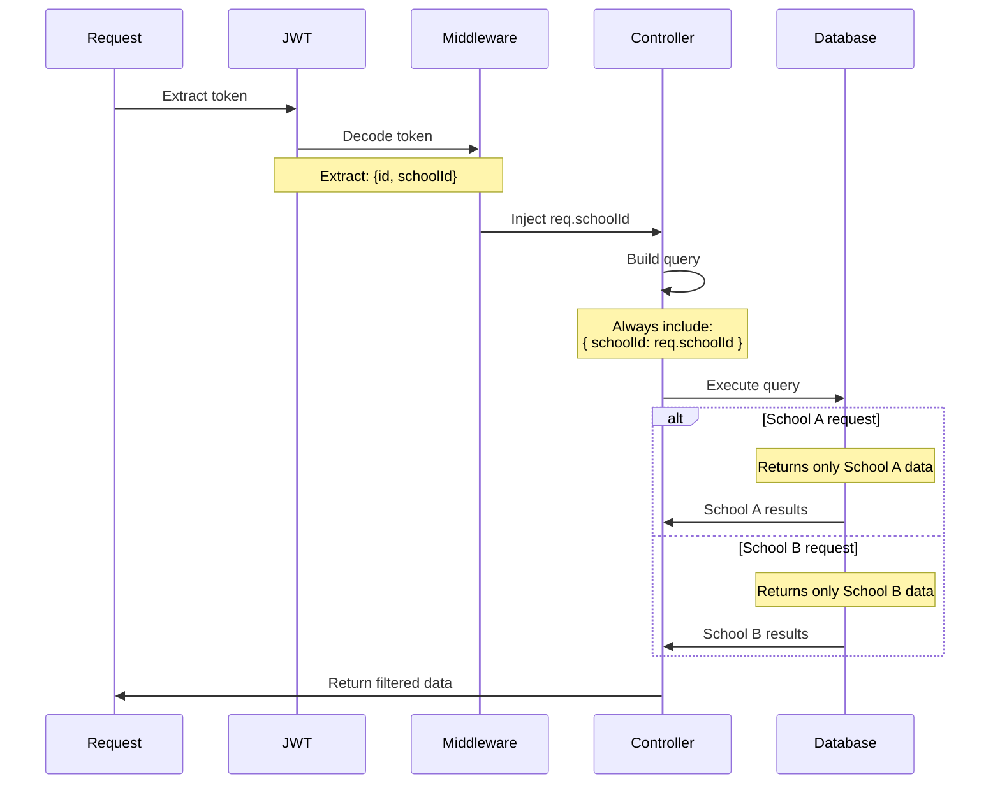
```mermaid
sequenceDiagram
    participant Request
    participant JWT
    participant Middleware
    participant Controller
    participant Database

    Request->>JWT: Extract token
    JWT->>Middleware: Decode token
    Note over JWT,Middleware: Extract: {id, schoolId}
    Middleware->>Controller: Inject req.schoolId
    Controller->>Controller: Build query
    Note over Controller: Always include:<br/>{ schoolId: req.schoolId }
    Controller->>Database: Execute query

    alt School A request
        Note over Database: Returns only School A data
        Database->>Controller: School A results
    else School B request
        Note over Database: Returns only School B data
        Database->>Controller: School B results
    end

    Controller->>Request: Return filtered data
```

## 5. Fee Payment Processing Flow

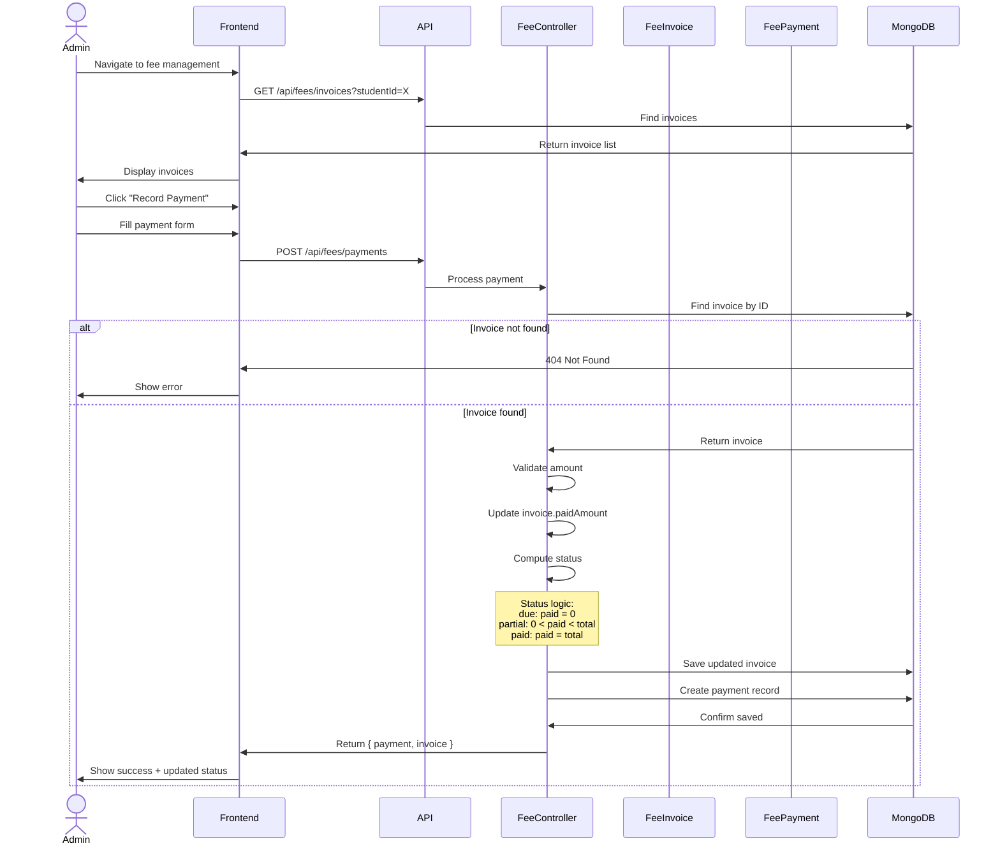
```mermaid
sequenceDiagram
    actor Admin
    participant Frontend
    participant API
    participant FeeController
    participant FeeInvoice
    participant FeePayment
    participant MongoDB

    Admin->>Frontend: Navigate to fee management
    Frontend->>API: GET /api/fees/invoices?studentId=X
    API->>MongoDB: Find invoices
    MongoDB->>Frontend: Return invoice list
    Frontend->>Admin: Display invoices

    Admin->>Frontend: Click "Record Payment"
    Admin->>Frontend: Fill payment form
    Frontend->>API: POST /api/fees/payments
    API->>FeeController: Process payment
    FeeController->>MongoDB: Find invoice by ID
    alt Invoice not found
        MongoDB->>Frontend: 404 Not Found
        Frontend->>Admin: Show error
    else Invoice found
        MongoDB->>FeeController: Return invoice
        FeeController->>FeeController: Validate amount
        FeeController->>FeeController: Update invoice.paidAmount
        FeeController->>FeeController: Compute status
        Note over FeeController: Status logic:<br/>due: paid = 0<br/>partial: 0 < paid < total<br/>paid: paid = total
        FeeController->>MongoDB: Save updated invoice
        FeeController->>MongoDB: Create payment record
        MongoDB->>FeeController: Confirm saved
        FeeController->>Frontend: Return { payment, invoice }
        Frontend->>Admin: Show success + updated status
    end
```

## 6. Bulk User Import Flow

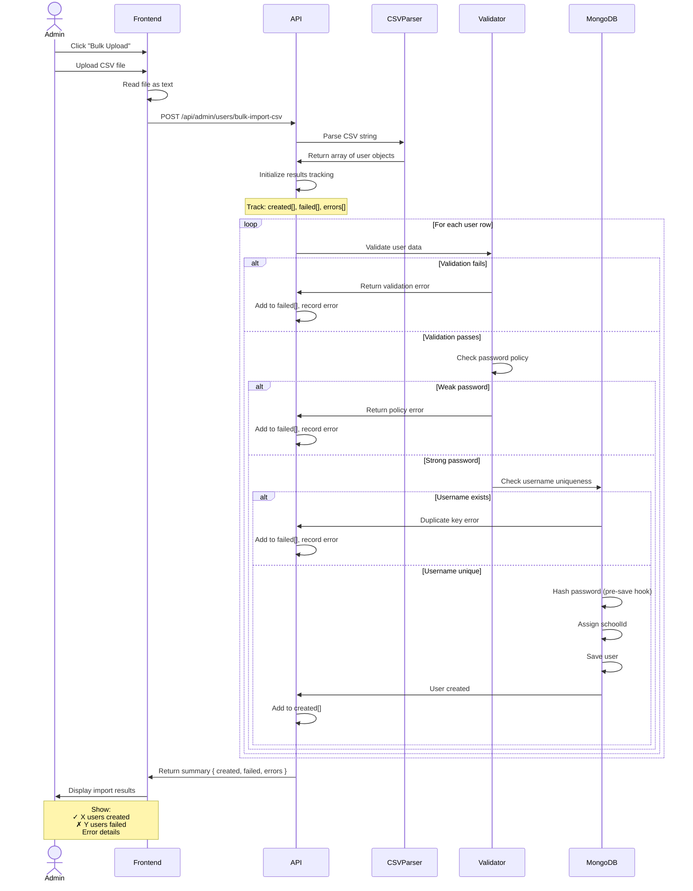
```mermaid
sequenceDiagram
    actor Admin
    participant Frontend
    participant API
    participant CSVParser
    participant Validator
    participant MongoDB

    Admin->>Frontend: Click "Bulk Upload"
    Admin->>Frontend: Upload CSV file
    Frontend->>Frontend: Read file as text
    Frontend->>API: POST /api/admin/users/bulk-import-csv
    API->>CSVParser: Parse CSV string
    CSVParser->>API: Return array of user objects
    API->>API: Initialize results tracking
    Note over API: Track: created[], failed[], errors[]

    loop For each user row
        API->>Validator: Validate user data
        alt Validation fails
            Validator->>API: Return validation error
            API->>API: Add to failed[], record error
        else Validation passes
            Validator->>Validator: Check password policy
            alt Weak password
                Validator->>API: Return policy error
                API->>API: Add to failed[], record error
            else Strong password
                Validator->>MongoDB: Check username uniqueness
                alt Username exists
                    MongoDB->>API: Duplicate key error
                    API->>API: Add to failed[], record error
                else Username unique
                    MongoDB->>MongoDB: Hash password (pre-save hook)
                    MongoDB->>MongoDB: Assign schoolId
                    MongoDB->>MongoDB: Save user
                    MongoDB->>API: User created
                    API->>API: Add to created[]
                end
            end
        end
    end

    API->>Frontend: Return summary { created, failed, errors }
    Frontend->>Admin: Display import results
    Note over Frontend,Admin: Show:<br/>✓ X users created<br/>✗ Y users failed<br/>Error details
```

## 7. Academic Hierarchy Setup Flow

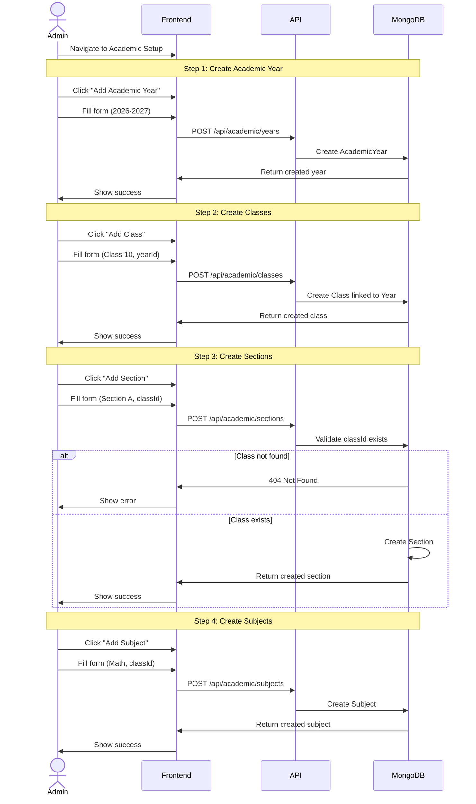
```mermaid
sequenceDiagram
    actor Admin
    participant Frontend
    participant API
    participant MongoDB

    Admin->>Frontend: Navigate to Academic Setup

    Note over Admin,MongoDB: Step 1: Create Academic Year
    Admin->>Frontend: Click "Add Academic Year"
    Admin->>Frontend: Fill form (2026-2027)
    Frontend->>API: POST /api/academic/years
    API->>MongoDB: Create AcademicYear
    MongoDB->>Frontend: Return created year
    Frontend->>Admin: Show success

    Note over Admin,MongoDB: Step 2: Create Classes
    Admin->>Frontend: Click "Add Class"
    Admin->>Frontend: Fill form (Class 10, yearId)
    Frontend->>API: POST /api/academic/classes
    API->>MongoDB: Create Class linked to Year
    MongoDB->>Frontend: Return created class
    Frontend->>Admin: Show success

    Note over Admin,MongoDB: Step 3: Create Sections
    Admin->>Frontend: Click "Add Section"
    Admin->>Frontend: Fill form (Section A, classId)
    Frontend->>API: POST /api/academic/sections
    API->>MongoDB: Validate classId exists
    alt Class not found
        MongoDB->>Frontend: 404 Not Found
        Frontend->>Admin: Show error
    else Class exists
        MongoDB->>MongoDB: Create Section
        MongoDB->>Frontend: Return created section
        Frontend->>Admin: Show success
    end

    Note over Admin,MongoDB: Step 4: Create Subjects
    Admin->>Frontend: Click "Add Subject"
    Admin->>Frontend: Fill form (Math, classId)
    Frontend->>API: POST /api/academic/subjects
    API->>MongoDB: Create Subject
    MongoDB->>Frontend: Return created subject
    Frontend->>Admin: Show success
```

## 8. Timetable Creation Flow

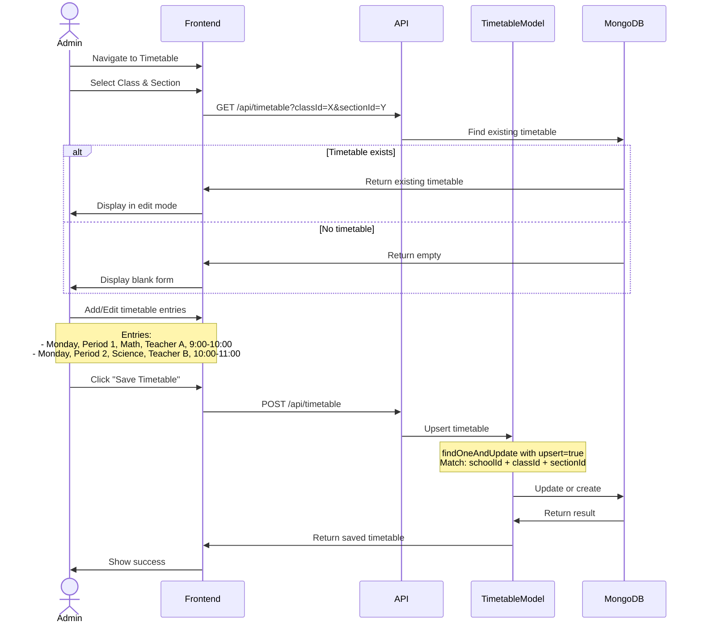
```mermaid
sequenceDiagram
    actor Admin
    participant Frontend
    participant API
    participant TimetableModel
    participant MongoDB

    Admin->>Frontend: Navigate to Timetable
    Admin->>Frontend: Select Class & Section
    Frontend->>API: GET /api/timetable?classId=X&sectionId=Y
    API->>MongoDB: Find existing timetable
    alt Timetable exists
        MongoDB->>Frontend: Return existing timetable
        Frontend->>Admin: Display in edit mode
    else No timetable
        MongoDB->>Frontend: Return empty
        Frontend->>Admin: Display blank form
    end

    Admin->>Frontend: Add/Edit timetable entries
    Note over Admin,Frontend: Entries:<br/>- Monday, Period 1, Math, Teacher A, 9:00-10:00<br/>- Monday, Period 2, Science, Teacher B, 10:00-11:00

    Admin->>Frontend: Click "Save Timetable"
    Frontend->>API: POST /api/timetable
    API->>TimetableModel: Upsert timetable
    Note over TimetableModel: findOneAndUpdate with upsert=true<br/>Match: schoolId + classId + sectionId
    TimetableModel->>MongoDB: Update or create
    MongoDB->>TimetableModel: Return result
    TimetableModel->>Frontend: Return saved timetable
    Frontend->>Admin: Show success
```

## 9. AI Weakness Analysis Flow

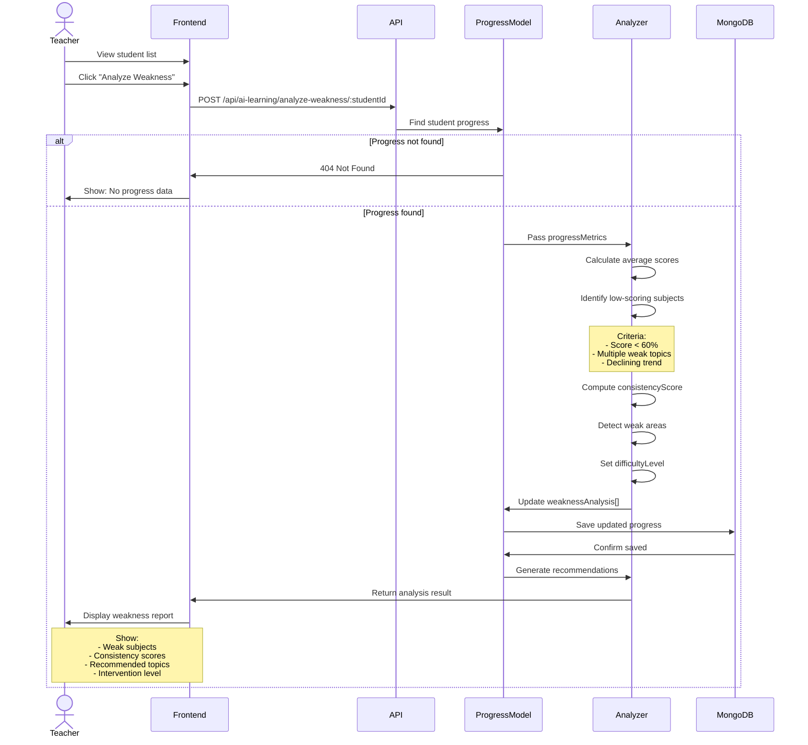
```mermaid
sequenceDiagram
    actor Teacher
    participant Frontend
    participant API
    participant ProgressModel
    participant Analyzer
    participant MongoDB

    Teacher->>Frontend: View student list
    Teacher->>Frontend: Click "Analyze Weakness"
    Frontend->>API: POST /api/ai-learning/analyze-weakness/:studentId
    API->>ProgressModel: Find student progress
    alt Progress not found
        ProgressModel->>Frontend: 404 Not Found
        Frontend->>Teacher: Show: No progress data
    else Progress found
        ProgressModel->>Analyzer: Pass progressMetrics
        Analyzer->>Analyzer: Calculate average scores
        Analyzer->>Analyzer: Identify low-scoring subjects
        Note over Analyzer: Criteria:<br/>- Score < 60%<br/>- Multiple weak topics<br/>- Declining trend
        Analyzer->>Analyzer: Compute consistencyScore
        Analyzer->>Analyzer: Detect weak areas
        Analyzer->>Analyzer: Set difficultyLevel
        Analyzer->>ProgressModel: Update weaknessAnalysis[]
        ProgressModel->>MongoDB: Save updated progress
        MongoDB->>ProgressModel: Confirm saved
        ProgressModel->>Analyzer: Generate recommendations
        Analyzer->>Frontend: Return analysis result
        Frontend->>Teacher: Display weakness report
        Note over Frontend,Teacher: Show:<br/>- Weak subjects<br/>- Consistency scores<br/>- Recommended topics<br/>- Intervention level
    end
```

## 10. AI Learning Path Generation Flow

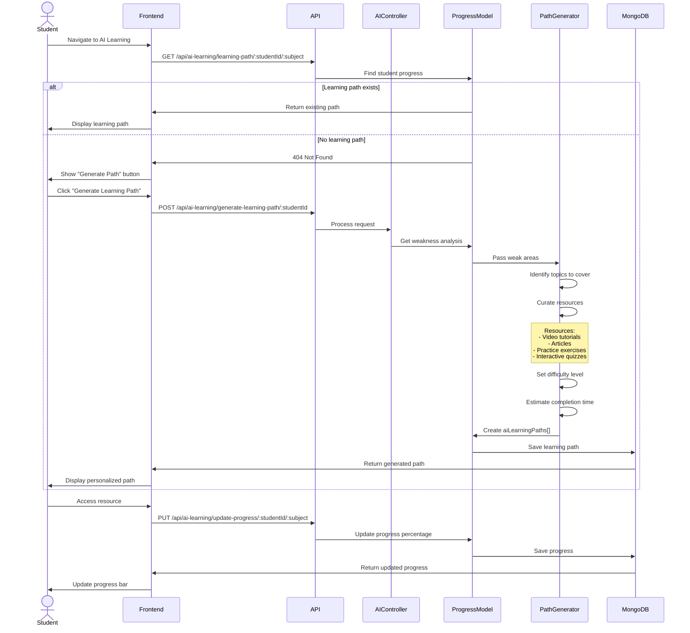
```mermaid
sequenceDiagram
    actor Student
    participant Frontend
    participant API
    participant AIController
    participant ProgressModel
    participant PathGenerator
    participant MongoDB

    Student->>Frontend: Navigate to AI Learning
    Frontend->>API: GET /api/ai-learning/learning-path/:studentId/:subject
    API->>ProgressModel: Find student progress
    alt Learning path exists
        ProgressModel->>Frontend: Return existing path
        Frontend->>Student: Display learning path
    else No learning path
        ProgressModel->>Frontend: 404 Not Found
        Frontend->>Student: Show "Generate Path" button

        Student->>Frontend: Click "Generate Learning Path"
        Frontend->>API: POST /api/ai-learning/generate-learning-path/:studentId
        API->>AIController: Process request
        AIController->>ProgressModel: Get weakness analysis
        ProgressModel->>PathGenerator: Pass weak areas
        PathGenerator->>PathGenerator: Identify topics to cover
        PathGenerator->>PathGenerator: Curate resources
        Note over PathGenerator: Resources:<br/>- Video tutorials<br/>- Articles<br/>- Practice exercises<br/>- Interactive quizzes
        PathGenerator->>PathGenerator: Set difficulty level
        PathGenerator->>PathGenerator: Estimate completion time
        PathGenerator->>ProgressModel: Create aiLearningPaths[]
        ProgressModel->>MongoDB: Save learning path
        MongoDB->>Frontend: Return generated path
        Frontend->>Student: Display personalized path
    end

    Student->>Frontend: Access resource
    Frontend->>API: PUT /api/ai-learning/update-progress/:studentId/:subject
    API->>ProgressModel: Update progress percentage
    ProgressModel->>MongoDB: Save progress
    MongoDB->>Frontend: Return updated progress
    Frontend->>Student: Update progress bar
```

## 11. Notification Broadcasting Flow

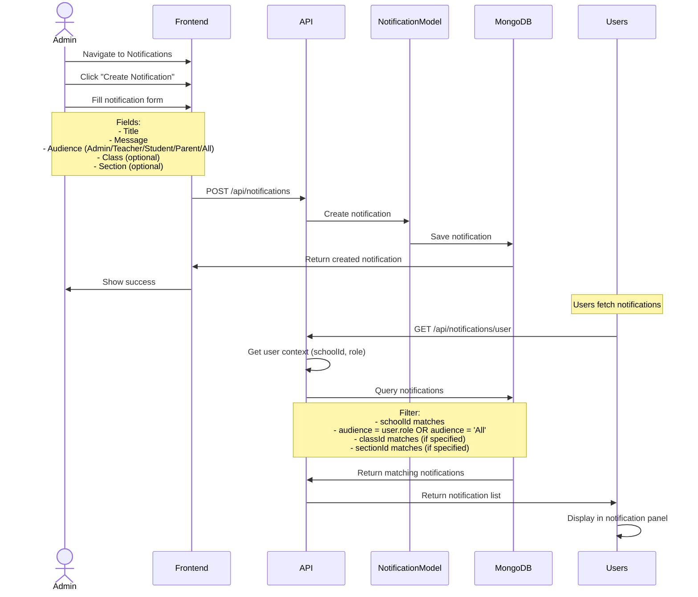
```mermaid
sequenceDiagram
    actor Admin
    participant Frontend
    participant API
    participant NotificationModel
    participant MongoDB
    participant Users

    Admin->>Frontend: Navigate to Notifications
    Admin->>Frontend: Click "Create Notification"
    Admin->>Frontend: Fill notification form
    Note over Admin,Frontend: Fields:<br/>- Title<br/>- Message<br/>- Audience (Admin/Teacher/Student/Parent/All)<br/>- Class (optional)<br/>- Section (optional)

    Frontend->>API: POST /api/notifications
    API->>NotificationModel: Create notification
    NotificationModel->>MongoDB: Save notification
    MongoDB->>Frontend: Return created notification
    Frontend->>Admin: Show success

    Note over Users: Users fetch notifications

    Users->>API: GET /api/notifications/user
    API->>API: Get user context (schoolId, role)
    API->>MongoDB: Query notifications
    Note over API,MongoDB: Filter:<br/>- schoolId matches<br/>- audience = user.role OR audience = 'All'<br/>- classId matches (if specified)<br/>- sectionId matches (if specified)
    MongoDB->>API: Return matching notifications
    API->>Users: Return notification list
    Users->>Users: Display in notification panel
```

## 12. Attendance Marking Flow

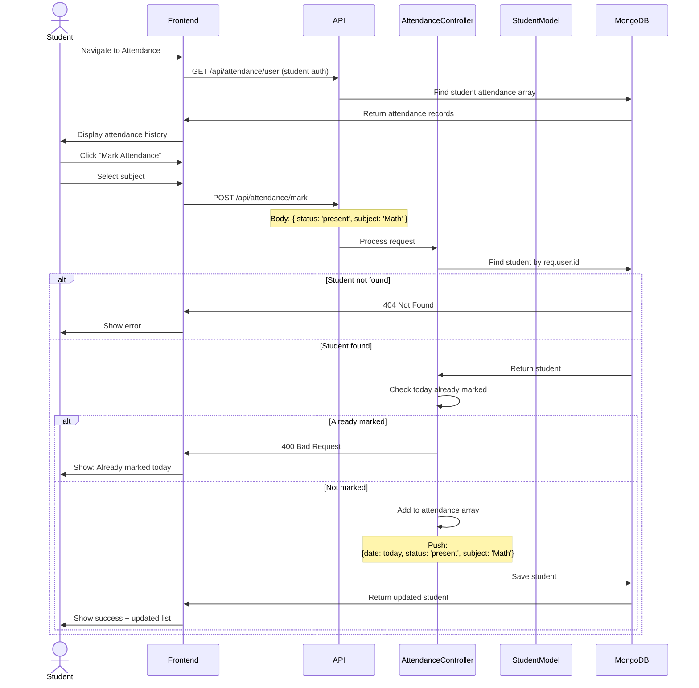
```mermaid
sequenceDiagram
    actor Student
    participant Frontend
    participant API
    participant AttendanceController
    participant StudentModel
    participant MongoDB

    Student->>Frontend: Navigate to Attendance
    Frontend->>API: GET /api/attendance/user (student auth)
    API->>MongoDB: Find student attendance array
    MongoDB->>Frontend: Return attendance records
    Frontend->>Student: Display attendance history

    Student->>Frontend: Click "Mark Attendance"
    Student->>Frontend: Select subject
    Frontend->>API: POST /api/attendance/mark
    Note over API: Body: { status: 'present', subject: 'Math' }
    API->>AttendanceController: Process request
    AttendanceController->>MongoDB: Find student by req.user.id
    alt Student not found
        MongoDB->>Frontend: 404 Not Found
        Frontend->>Student: Show error
    else Student found
        MongoDB->>AttendanceController: Return student
        AttendanceController->>AttendanceController: Check today already marked
        alt Already marked
            AttendanceController->>Frontend: 400 Bad Request
            Frontend->>Student: Show: Already marked today
        else Not marked
            AttendanceController->>AttendanceController: Add to attendance array
            Note over AttendanceController: Push:<br/>{date: today, status: 'present', subject: 'Math'}
            AttendanceController->>MongoDB: Save student
            MongoDB->>Frontend: Return updated student
            Frontend->>Student: Show success + updated list
        end
    end
```

## 13. NIF Student Enrollment Flow

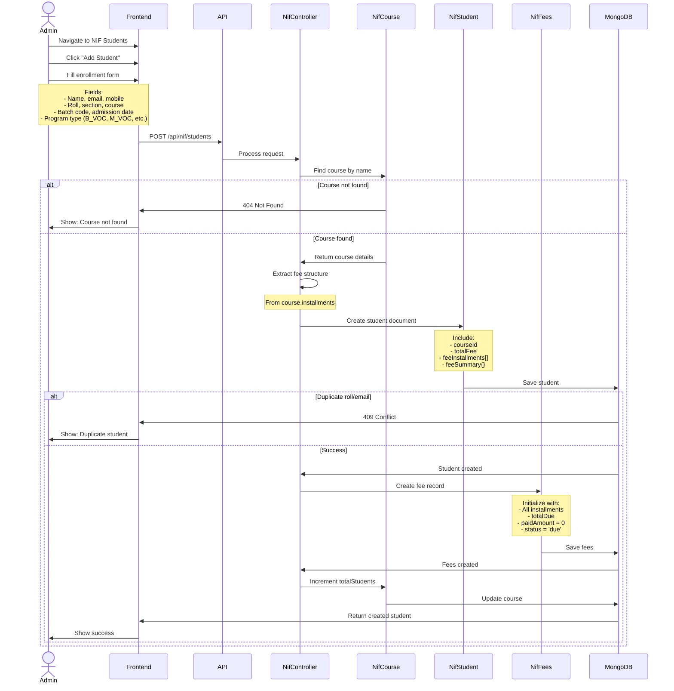
```mermaid
sequenceDiagram
    actor Admin
    participant Frontend
    participant API
    participant NifController
    participant NifCourse
    participant NifStudent
    participant NifFees
    participant MongoDB

    Admin->>Frontend: Navigate to NIF Students
    Admin->>Frontend: Click "Add Student"
    Admin->>Frontend: Fill enrollment form
    Note over Admin,Frontend: Fields:<br/>- Name, email, mobile<br/>- Roll, section, course<br/>- Batch code, admission date<br/>- Program type (B_VOC, M_VOC, etc.)

    Frontend->>API: POST /api/nif/students
    API->>NifController: Process request
    NifController->>NifCourse: Find course by name
    alt Course not found
        NifCourse->>Frontend: 404 Not Found
        Frontend->>Admin: Show: Course not found
    else Course found
        NifCourse->>NifController: Return course details
        NifController->>NifController: Extract fee structure
        Note over NifController: From course.installments
        NifController->>NifStudent: Create student document
        Note over NifStudent: Include:<br/>- courseId<br/>- totalFee<br/>- feeInstallments[]<br/>- feeSummary{}
        NifStudent->>MongoDB: Save student
        alt Duplicate roll/email
            MongoDB->>Frontend: 409 Conflict
            Frontend->>Admin: Show: Duplicate student
        else Success
            MongoDB->>NifController: Student created
            NifController->>NifFees: Create fee record
            Note over NifFees: Initialize with:<br/>- All installments<br/>- totalDue<br/>- paidAmount = 0<br/>- status = 'due'
            NifFees->>MongoDB: Save fees
            MongoDB->>NifController: Fees created
            NifController->>NifCourse: Increment totalStudents
            NifCourse->>MongoDB: Update course
            MongoDB->>Frontend: Return created student
            Frontend->>Admin: Show success
        end
    end
```

## 14. NIF Fee Payment Flow

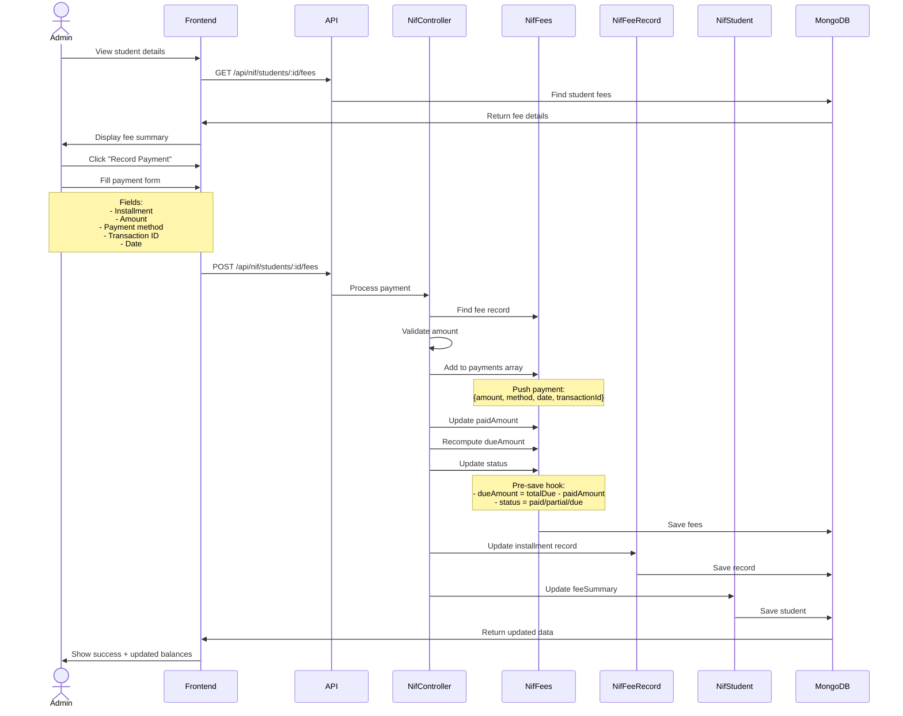
```mermaid
sequenceDiagram
    actor Admin
    participant Frontend
    participant API
    participant NifController
    participant NifFees
    participant NifFeeRecord
    participant NifStudent
    participant MongoDB

    Admin->>Frontend: View student details
    Frontend->>API: GET /api/nif/students/:id/fees
    API->>MongoDB: Find student fees
    MongoDB->>Frontend: Return fee details
    Frontend->>Admin: Display fee summary

    Admin->>Frontend: Click "Record Payment"
    Admin->>Frontend: Fill payment form
    Note over Admin,Frontend: Fields:<br/>- Installment<br/>- Amount<br/>- Payment method<br/>- Transaction ID<br/>- Date

    Frontend->>API: POST /api/nif/students/:id/fees
    API->>NifController: Process payment
    NifController->>NifFees: Find fee record
    NifController->>NifController: Validate amount
    NifController->>NifFees: Add to payments array
    Note over NifFees: Push payment:<br/>{amount, method, date, transactionId}
    NifController->>NifFees: Update paidAmount
    NifController->>NifFees: Recompute dueAmount
    NifController->>NifFees: Update status
    Note over NifFees: Pre-save hook:<br/>- dueAmount = totalDue - paidAmount<br/>- status = paid/partial/due
    NifFees->>MongoDB: Save fees
    NifController->>NifFeeRecord: Update installment record
    NifFeeRecord->>MongoDB: Save record
    NifController->>NifStudent: Update feeSummary
    NifStudent->>MongoDB: Save student
    MongoDB->>Frontend: Return updated data
    Frontend->>Admin: Show success + updated balances
```

## 15. File Upload Flow

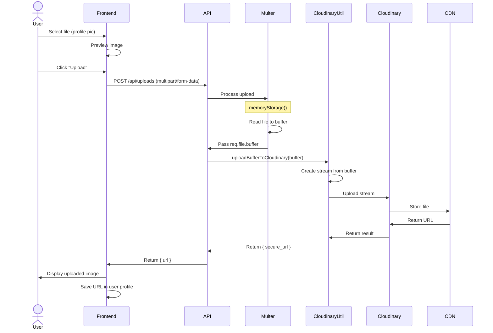
```mermaid
sequenceDiagram
    actor User
    participant Frontend
    participant API
    participant Multer
    participant CloudinaryUtil
    participant Cloudinary
    participant CDN

    User->>Frontend: Select file (profile pic)
    Frontend->>Frontend: Preview image
    User->>Frontend: Click "Upload"
    Frontend->>API: POST /api/uploads (multipart/form-data)
    API->>Multer: Process upload
    Note over Multer: memoryStorage()
    Multer->>Multer: Read file to buffer
    Multer->>API: Pass req.file.buffer
    API->>CloudinaryUtil: uploadBufferToCloudinary(buffer)
    CloudinaryUtil->>CloudinaryUtil: Create stream from buffer
    CloudinaryUtil->>Cloudinary: Upload stream
    Cloudinary->>CDN: Store file
    CDN->>Cloudinary: Return URL
    Cloudinary->>CloudinaryUtil: Return result
    CloudinaryUtil->>API: Return { secure_url }
    API->>Frontend: Return { url }
    Frontend->>User: Display uploaded image
    Frontend->>Frontend: Save URL in user profile
```

## 16. Audit Log Creation Flow

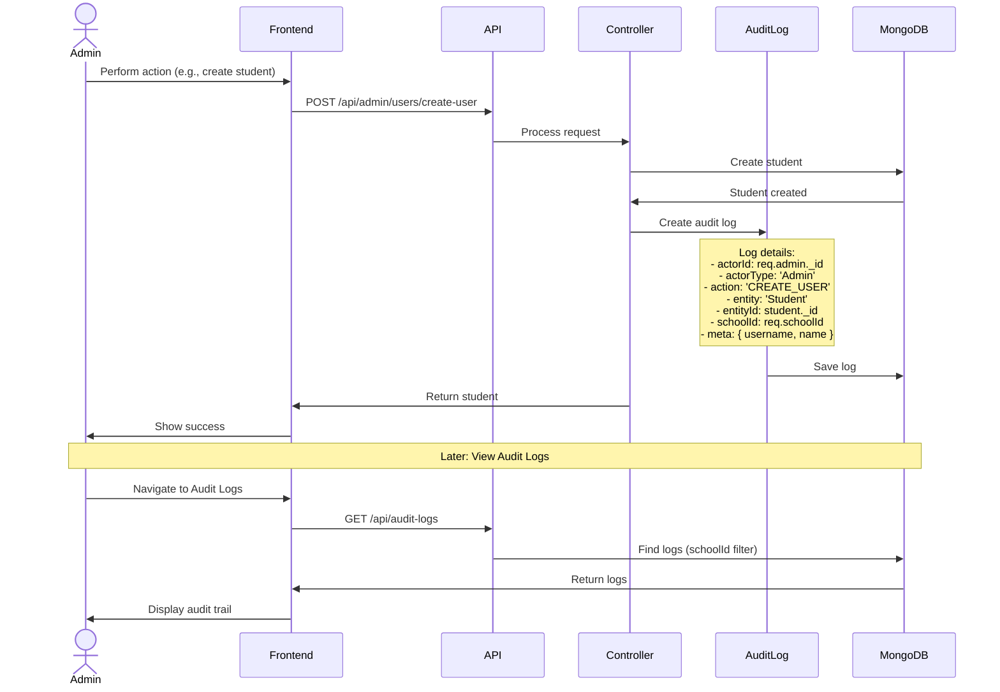
```mermaid
sequenceDiagram
    actor Admin
    participant Frontend
    participant API
    participant Controller
    participant AuditLog
    participant MongoDB

    Admin->>Frontend: Perform action (e.g., create student)
    Frontend->>API: POST /api/admin/users/create-user
    API->>Controller: Process request
    Controller->>MongoDB: Create student
    MongoDB->>Controller: Student created

    Controller->>AuditLog: Create audit log
    Note over AuditLog: Log details:<br/>- actorId: req.admin._id<br/>- actorType: 'Admin'<br/>- action: 'CREATE_USER'<br/>- entity: 'Student'<br/>- entityId: student._id<br/>- schoolId: req.schoolId<br/>- meta: { username, name }
    AuditLog->>MongoDB: Save log

    Controller->>Frontend: Return student
    Frontend->>Admin: Show success

    Note over Admin,MongoDB: Later: View Audit Logs
    Admin->>Frontend: Navigate to Audit Logs
    Frontend->>API: GET /api/audit-logs
    API->>MongoDB: Find logs (schoolId filter)
    MongoDB->>Frontend: Return logs
    Frontend->>Admin: Display audit trail
```

---

**Document Version:** 1.0
**Last Updated:** 2026-01-12
**Author:** Architecture Team
