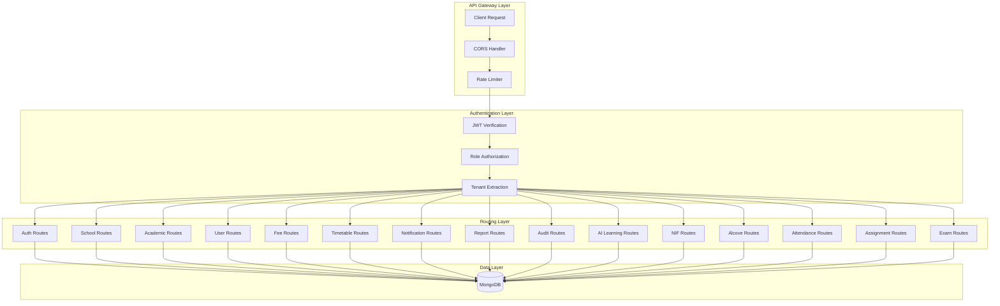
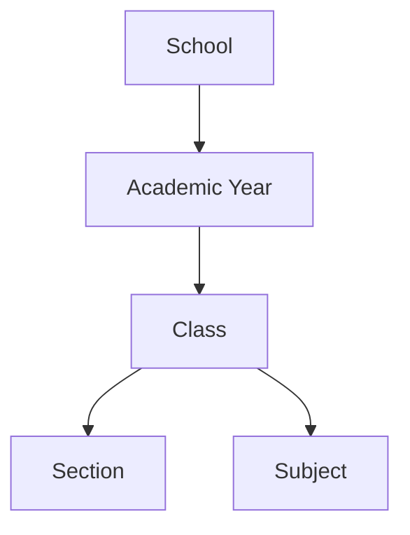
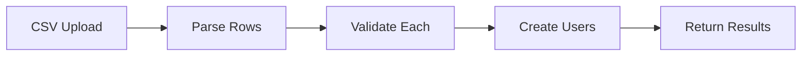

# API Architecture - EEC-NIF System

## 1. API Design Principles

### RESTful Design
- Resource-based URLs
- HTTP methods for CRUD operations
- Stateless communication
- JSON request/response format
- Meaningful HTTP status codes

### Tenant Isolation
- Every API call scoped by `schoolId`
- Extracted from JWT token
- Enforced at middleware level
- No cross-tenant data access

### Authentication Strategy
- JWT-based stateless auth
- Token in Authorization header
- Role-based access control
- 1-day token expiry

### Versioning Strategy
- Currently: No versioning (v1 implicit)
- Future: `/api/v2/...` for breaking changes

## 2. API Architecture Overview



## 3. Complete API Endpoint Catalog

### 3.1 Authentication APIs

#### Admin Authentication
```
POST   /api/admin/auth/register
POST   /api/admin/auth/login (rate limited: 10/min)
GET    /api/admin/auth/profile
```

#### Teacher Authentication
```
POST   /api/teacher/auth/register
POST   /api/teacher/auth/login (rate limited: 10/min)
GET    /api/teacher/auth/profile
```

#### Student Authentication
```
POST   /api/student/auth/register
POST   /api/student/auth/login (rate limited: 10/min)
GET    /api/student/auth/profile
```

#### Parent Authentication
```
POST   /api/parent/auth/register
POST   /api/parent/auth/login (rate limited: 10/min)
GET    /api/parent/auth/profile
```

**Authentication Flow:**


### 3.2 School Management APIs

```
POST   /api/schools
       Body: { name, code?, address?, contactEmail?, contactPhone? }
       Auth: Admin only
       Response: Created school object

GET    /api/schools
       Auth: Admin only
       Response: Array of schools

GET    /api/schools/:id
       Auth: Admin only
       Response: School object
```

**Multi-Tenant Note:** School management typically reserved for super admins (no schoolId in token).

### 3.3 Academic Setup APIs

```
POST   /api/academic/years
       Body: { name, startDate?, endDate?, isActive? }
       Auth: Admin (tenant-scoped)
       Response: Created academic year

GET    /api/academic/years
       Query: ?isActive=true
       Auth: Admin (tenant-scoped)
       Response: Array of academic years

POST   /api/academic/classes
       Body: { name, academicYearId?, order? }
       Auth: Admin (tenant-scoped)
       Response: Created class

GET    /api/academic/classes
       Query: ?academicYearId=xxx
       Auth: Admin (tenant-scoped)
       Response: Array of classes

POST   /api/academic/sections
       Body: { name, classId }
       Auth: Admin (tenant-scoped)
       Response: Created section

GET    /api/academic/sections
       Query: ?classId=xxx
       Auth: Admin (tenant-scoped)
       Response: Array of sections

POST   /api/academic/subjects
       Body: { name, code?, classId? }
       Auth: Admin (tenant-scoped)
       Response: Created subject

GET    /api/academic/subjects
       Query: ?classId=xxx
       Auth: Admin (tenant-scoped)
       Response: Array of subjects
```

**Hierarchy Model:**


### 3.4 User Management APIs

```
POST   /api/admin/users/create-user
       Body: { userType, username, password, name, schoolId?, ...roleFields }
       Auth: Admin
       Response: Created user object

POST   /api/admin/users/bulk-create-users
       Body: { users: [...] }
       Auth: Admin
       Response: { created, failed, errors }

POST   /api/admin/users/bulk-import-csv
       Body: { csvData }
       Auth: Admin
       Response: { created, failed, errors }

GET    /api/admin/users/get-students
       Auth: Admin (tenant-scoped)
       Response: Array of students

GET    /api/admin/users/get-teachers
       Auth: Admin (tenant-scoped)
       Response: Array of teachers

GET    /api/admin/users/get-parents
       Auth: Admin (tenant-scoped)
       Response: Array of parents

GET    /api/admin/users/dashboard-stats
       Auth: Admin (tenant-scoped)
       Response: { totalStudents, totalTeachers, totalParents, recentRegistrations }
```

**Bulk Import Flow:**


### 3.5 Fee Management APIs

```
POST   /api/fees/structures
       Body: { name, academicYearId?, classId?, totalAmount, installments[], isActive? }
       Auth: Admin (tenant-scoped)
       Response: Created fee structure

GET    /api/fees/structures
       Query: ?classId=xxx&academicYearId=yyy
       Auth: Admin (tenant-scoped)
       Response: Array of fee structures

POST   /api/fees/invoices
       Body: { studentId, feeStructureId?, academicYearId?, classId?, title, totalAmount, dueDate? }
       Auth: Admin (tenant-scoped)
       Response: Created invoice

GET    /api/fees/invoices
       Query: ?studentId=xxx&status=due
       Auth: Admin (tenant-scoped)
       Response: Array of invoices

POST   /api/fees/payments
       Body: { invoiceId, studentId, amount, method?, notes? }
       Auth: Admin (tenant-scoped)
       Response: Created payment + updated invoice

GET    /api/fees/payments
       Query: ?invoiceId=xxx&studentId=yyy
       Auth: Admin (tenant-scoped)
       Response: Array of payments
```

**Fee Status Logic:**
```
status = 'due'     if paidAmount === 0
status = 'partial' if 0 < paidAmount < totalAmount
status = 'paid'    if paidAmount === totalAmount
```

### 3.6 Timetable APIs

```
POST   /api/timetable
       Body: { classId, sectionId?, academicYearId?, entries: [{ dayOfWeek, period, subjectId?, teacherId?, startTime?, endTime?, room? }] }
       Auth: Admin (tenant-scoped)
       Note: Upsert pattern (update existing or create new)
       Response: Saved timetable

GET    /api/timetable
       Query: ?classId=xxx&sectionId=yyy
       Auth: Admin (tenant-scoped)
       Response: Timetable object
```

### 3.7 Notification APIs

```
POST   /api/notifications
       Body: { title, message, audience, classId?, sectionId?, createdBy? }
       Auth: Admin (tenant-scoped)
       Response: Created notification

GET    /api/notifications
       Auth: Admin (tenant-scoped)
       Response: Array of all notifications

GET    /api/notifications/user
       Auth: Any authenticated user
       Response: Array of user-specific notifications (filtered by role, class, section)
```

**Audience Options:**
- `Admin` - Only admins
- `Teacher` - Only teachers
- `Student` - Only students
- `Parent` - Only parents
- `All` - Everyone

### 3.8 Report APIs

```
GET    /api/reports/summary
       Auth: Admin (tenant-scoped)
       Response: {
         userCounts: { students, teachers, parents },
         feeTotals: { totalAmount, paidAmount, balanceAmount },
         attendanceTotals: { marked, present, absent, rate }
       }
```

### 3.9 Audit Log APIs

```
POST   /api/audit-logs
       Body: { actorId, actorType, action, entity?, entityId?, meta? }
       Auth: Admin (tenant-scoped)
       Response: Created audit log

GET    /api/audit-logs
       Query: ?actorId=xxx&action=yyy
       Auth: Admin (tenant-scoped)
       Response: Array of audit logs
```

### 3.10 Attendance APIs

```
POST   /api/attendance/mark
       Body: { status, subject? }
       Auth: Student (self-marking)
       Note: Adds to embedded attendance array
       Response: Updated student object

GET    /api/attendance/all
       Auth: Teacher (tenant-scoped)
       Response: Array of all student attendance records

GET    /api/attendance/admin/all
       Auth: Admin (tenant-scoped)
       Response: Array of all student attendance records
```

### 3.11 Assignment APIs

```
POST   /api/assignment
       Body: { title, subject, class, marks, status?, dueDate? }
       Auth: Teacher/Admin (tenant-scoped)
       Response: Created assignment

GET    /api/assignment
       Query: ?class=xxx&subject=yyy
       Auth: Teacher/Admin/Student (tenant-scoped)
       Response: Array of assignments
```

### 3.12 Exam APIs

```
POST   /api/exam/add
       Body: { title, subject, instructor, venue, date, time, duration, marks, noOfStudents?, status? }
       Auth: Teacher/Admin (tenant-scoped)
       Response: Created exam

GET    /api/exam/fetch
       Query: ?subject=xxx
       Auth: Teacher/Admin/Student (tenant-scoped)
       Response: Array of exams
```

### 3.13 Course APIs

```
POST   /api/course
       Body: { courseName, courseCode, description?, duration?, credits?, department, prerequisites?, instructor?, startingDate?, totalStudents?, status? }
       Auth: Admin (tenant-scoped)
       Response: Created course

GET    /api/course
       Query: ?department=xxx&status=Active
       Auth: Admin/Teacher (tenant-scoped)
       Response: Array of courses
```

### 3.14 AI Learning APIs

```
POST   /api/ai-learning/analyze-weakness/:studentId
       Auth: Teacher/Admin
       Response: Updated student progress with weakness analysis

GET    /api/ai-learning/weak-students
       Query: ?subject=xxx&interventionLevel=high
       Auth: Teacher/Admin (tenant-scoped)
       Response: Array of students needing intervention

POST   /api/ai-learning/generate-learning-path/:studentId
       Body: { subject }
       Auth: Teacher/Admin
       Response: Generated learning path with resources

GET    /api/ai-learning/learning-path/:studentId/:subject
       Auth: Teacher/Admin/Student
       Response: Existing learning path

PUT    /api/ai-learning/update-progress/:studentId/:subject
       Body: { completedTopics[], progress }
       Auth: Student
       Response: Updated learning path
```

### 3.15 Alcove (Collaboration) APIs

```
POST   /api/alcove/posts
       Body: { title, subject, chapter, difficulty, problemText, solutionText, highlighted?, tags[] }
       Auth: Teacher (tenant-scoped)
       Response: Created post

GET    /api/alcove/posts
       Query: ?subject=xxx&difficulty=medium&chapter=yyy
       Auth: Teacher/Student (tenant-scoped)
       Response: Array of posts

GET    /api/alcove/posts/:id
       Auth: Teacher/Student (tenant-scoped)
       Response: Post details

PATCH  /api/alcove/posts/:id
       Body: { ...fields to update }
       Auth: Teacher (author only)
       Response: Updated post

GET    /api/alcove/posts/:id/comments
       Auth: Teacher/Student (tenant-scoped)
       Response: Array of comments

POST   /api/alcove/posts/:id/comments
       Body: { content }
       Auth: Teacher/Student (tenant-scoped)
       Response: Created comment
```

### 3.16 NIF APIs

#### NIF Student Management
```
POST   /api/nif/students
       Body: { name, email?, mobile, gender, dob?, guardianName?, guardianEmail?, guardianPhone?, address?, pincode?, serialNo?, batchCode, admissionDate, academicYear?, roll, grade?, section, course, courseId?, duration?, formNo?, enrollmentNo?, stream?, programType?, programLabel?, totalFee?, feeInstallments[], status? }
       Auth: Admin
       Response: Created NIF student

GET    /api/nif/students
       Query: ?programType=B_VOC&section=A&isArchived=false
       Auth: Admin
       Response: Array of NIF students

POST   /api/nif/students/bulk-import
       Body: { csvData or students: [...] }
       Auth: Admin
       Response: { created, failed, errors }

GET    /api/nif/students/:id
       Auth: Admin
       Response: NIF student details

PUT    /api/nif/students/:id
       Body: { ...fields to update }
       Auth: Admin
       Response: Updated student

DELETE /api/nif/students/:id
       Auth: Admin
       Note: Archives student (sets isArchived=true)
       Response: Success message

GET    /api/nif/students/archived
       Auth: Admin
       Response: Array of archived students

POST   /api/nif/students/:id/fees
       Body: { installmentLabel, amount, paymentMethod, transactionId?, remarks? }
       Auth: Admin
       Response: Updated fee record

GET    /api/nif/students/:id/fees
       Auth: Admin
       Response: Fee details with payment history
```

#### NIF Course Management
```
POST   /api/nif/course
       Body: { title, department, programType, programLabel?, desc?, duration, fees, installments[], instructor?, totalStudents?, startingDate?, status?, createdBy? }
       Auth: Admin
       Response: Created NIF course

GET    /api/nif/course
       Query: ?department=Fashion&status=Active&programType=B_VOC
       Auth: Admin
       Response: Array of NIF courses

GET    /api/nif/course/:id
       Auth: Admin
       Response: NIF course details

PUT    /api/nif/course/:id
       Body: { ...fields to update, updatedBy }
       Auth: Admin
       Response: Updated course

DELETE /api/nif/course/:id
       Auth: Admin
       Response: Success message
```

### 3.17 Behaviour Analytics APIs

```
POST   /api/behaviour
       Body: { studentClass, subject, questionType?, startTime, endTime, correct, incorrect }
       Auth: System/Teacher (tenant-scoped)
       Response: Created behaviour log

GET    /api/behaviour
       Query: ?studentClass=10&subject=Math
       Auth: Teacher/Admin (tenant-scoped)
       Response: Array of behaviour logs
```

### 3.18 Feedback APIs

```
POST   /api/feedback
       Body: { role, name, schoolName?, phone?, email?, class?, consent, rating, feedback }
       Auth: Public (no auth required)
       Response: Created feedback

GET    /api/feedback
       Auth: Admin (tenant-scoped)
       Response: Array of feedback submissions
```

### 3.19 File Upload APIs

```
POST   /api/uploads
       Body: multipart/form-data (file)
       Auth: Admin/Teacher/Student
       Note: Uses Multer + Cloudinary
       Response: { url: 'https://cloudinary.com/...' }
```

## 4. HTTP Status Codes

### Success Codes
```
200 OK              - Successful GET, PUT requests
201 Created         - Successful POST (resource created)
204 No Content      - Successful DELETE
```

### Client Error Codes
```
400 Bad Request     - Invalid input, validation errors
401 Unauthorized    - Missing or invalid token
403 Forbidden       - Insufficient permissions
404 Not Found       - Resource not found
409 Conflict        - Duplicate key, uniqueness violation
422 Unprocessable   - Semantic errors
429 Too Many Requests - Rate limit exceeded
```

### Server Error Codes
```
500 Internal Server Error - Unhandled exceptions
503 Service Unavailable   - Database down, external service failure
```

## 5. Request/Response Patterns

### Standard Request Format

```javascript
// POST/PUT with body
{
  method: 'POST',
  headers: {
    'Content-Type': 'application/json',
    'Authorization': 'Bearer <jwt_token>'
  },
  body: JSON.stringify({ field1: value1, field2: value2 })
}

// GET with query params
{
  method: 'GET',
  headers: {
    'Authorization': 'Bearer <jwt_token>'
  }
}
// URL: /api/resource?param1=value1&param2=value2
```

### Standard Response Format

**Success:**
```json
// Single resource
{
  "_id": "507f1f77bcf86cd799439011",
  "field1": "value1",
  "field2": "value2",
  "createdAt": "2026-01-12T10:00:00.000Z",
  "updatedAt": "2026-01-12T10:00:00.000Z"
}

// Multiple resources
[
  { "_id": "...", "field1": "..." },
  { "_id": "...", "field1": "..." }
]

// Operation result
{
  "message": "Operation successful",
  "count": 42
}
```

**Error:**
```json
{
  "error": "Error message describing what went wrong"
}
```

## 6. Authentication & Authorization Matrix

| Route | Admin | Teacher | Student | Parent | Public |
|-------|-------|---------|---------|--------|--------|
| POST /api/admin/auth/register | ✓ | ✗ | ✗ | ✗ | ✗ |
| POST /api/{role}/auth/login | ✓ | ✓ | ✓ | ✓ | ✓ |
| POST /api/schools | ✓ | ✗ | ✗ | ✗ | ✗ |
| POST /api/academic/* | ✓ | ✗ | ✗ | ✗ | ✗ |
| GET /api/academic/* | ✓ | ✓ | ✗ | ✗ | ✗ |
| POST /api/admin/users/* | ✓ | ✗ | ✗ | ✗ | ✗ |
| POST /api/fees/* | ✓ | ✗ | ✗ | ✗ | ✗ |
| GET /api/fees/* | ✓ | ✓ | ✗ | ✓ | ✗ |
| POST /api/timetable | ✓ | ✗ | ✗ | ✗ | ✗ |
| GET /api/timetable | ✓ | ✓ | ✓ | ✗ | ✗ |
| POST /api/notifications | ✓ | ✗ | ✗ | ✗ | ✗ |
| GET /api/notifications/user | ✓ | ✓ | ✓ | ✓ | ✗ |
| POST /api/attendance/mark | ✗ | ✗ | ✓ | ✗ | ✗ |
| GET /api/attendance/all | ✗ | ✓ | ✗ | ✗ | ✗ |
| POST /api/assignment | ✓ | ✓ | ✗ | ✗ | ✗ |
| GET /api/assignment | ✓ | ✓ | ✓ | ✗ | ✗ |
| POST /api/alcove/posts | ✗ | ✓ | ✗ | ✗ | ✗ |
| GET /api/alcove/posts | ✓ | ✓ | ✓ | ✗ | ✗ |
| POST /api/ai-learning/* | ✓ | ✓ | ✗ | ✗ | ✗ |
| GET /api/ai-learning/* | ✓ | ✓ | ✓ | ✗ | ✗ |
| POST /api/nif/* | ✓ | ✗ | ✗ | ✗ | ✗ |
| GET /api/nif/* | ✓ | ✗ | ✗ | ✗ | ✗ |
| POST /api/feedback | ✓ | ✓ | ✓ | ✓ | ✓ |

## 7. Rate Limiting Configuration

```javascript
// Applied to login endpoints
Rate Limit: 10 requests per minute per IP
Window: 60 seconds
Max Requests: 10
Response: 429 Too Many Requests
Reset: After window expires

// Endpoints with rate limiting:
- POST /api/admin/auth/login
- POST /api/teacher/auth/login
- POST /api/student/auth/login
- POST /api/parent/auth/login
```

## 8. CORS Configuration

```javascript
// Whitelist-based CORS
Allowed Origins: From env CORS_ORIGINS (comma-separated)
Allowed Methods: GET, POST, PUT, DELETE, PATCH, OPTIONS
Allowed Headers: Content-Type, Authorization
Credentials: true

// Fallback: Allow all origins if CORS_ORIGINS not set (development only)
```

## 9. Query Parameter Patterns

### Filtering
```
GET /api/resource?field=value
GET /api/resource?field1=value1&field2=value2
```

### Sorting (Not globally implemented, but available in some routes)
```
GET /api/resource?sortBy=createdAt&order=desc
```

### Pagination (Not globally implemented, recommended for future)
```
GET /api/resource?page=1&limit=20
```

### Search (Limited implementation)
```
GET /api/resource?search=keyword
```

## 10. Batch Operations

### Bulk Create Users
```
POST /api/admin/users/bulk-create-users
Body: {
  users: [
    { userType: 'student', username: 'john', password: 'Pass123', ... },
    { userType: 'teacher', username: 'jane', password: 'Pass456', ... }
  ]
}
Response: {
  created: 15,
  failed: 2,
  errors: [
    { row: 3, error: 'Duplicate username' },
    { row: 7, error: 'Weak password' }
  ]
}
```

### CSV Import
```
POST /api/admin/users/bulk-import-csv
Body: {
  csvData: "username,password,name,email\njohn,Pass123,John Doe,john@example.com\n..."
}
Response: { created, failed, errors }
```

## 11. Error Response Examples

### Validation Error
```json
{
  "error": "Password must be at least 8 characters"
}
```

### Authentication Error
```json
{
  "error": "Invalid token"
}
```

### Authorization Error
```json
{
  "error": "Access denied"
}
```

### Resource Not Found
```json
{
  "error": "Student not found"
}
```

### Duplicate Key Error
```json
{
  "error": "Username already exists"
}
```

### Rate Limit Error
```json
{
  "error": "Too many requests, please try again later"
}
```

## 12. API Performance Optimizations

### Database Indexes
- All tenant queries indexed on `schoolId`
- Unique fields indexed (username, email, roll)
- Compound indexes for common queries

### Caching Strategy (Recommended)
```javascript
// Redis cache for frequently accessed data
- User profiles (TTL: 1 hour)
- Academic hierarchy (TTL: 24 hours)
- Fee structures (TTL: 12 hours)
- Timetables (TTL: 24 hours)
```

### Query Optimization
- Use `.lean()` for read-only queries
- Limit fields with `.select()`
- Paginate large result sets
- Use aggregation pipelines for reports

## 13. API Documentation Tools

### Recommended: Swagger/OpenAPI
```yaml
# Example OpenAPI spec
openapi: 3.0.0
info:
  title: EEC-NIF API
  version: 1.0.0
paths:
  /api/students:
    get:
      summary: List students
      security:
        - bearerAuth: []
      responses:
        200:
          description: Array of students
```

### Alternative: Postman Collection
- Export collection with all endpoints
- Include environment variables
- Add example requests/responses

---

**Document Version:** 1.0
**Last Updated:** 2026-01-12
**Author:** API Architecture Team
