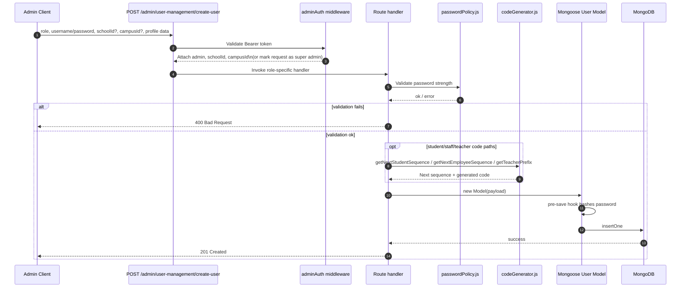

# User Creation Flow

This document summarizes how users are created through `POST /admin/user-management/create-user`. It is based on `backend/routes/adminUserManagement.js` and the utilities/middleware it depends on.

## Sequence Diagram

## Flow Breakdown

1. **Request scope (`backend/middleware/adminAuth.js`)**
   - Confirms a valid admin JWT and derives `req.schoolId` and `req.campusId`. Super admins (no school in token) must supply these IDs in headers/body/query. Requests without a resolvable school are rejected by the handler.

2. **Role and payload validation (`backend/routes/adminUserManagement.js`)**
   - `getModelByRole` maps the requested `role` to one of `StudentUser`, `TeacherUser`, `ParentUser`, `StaffUser`, or `Principal`.
   - Common fields (`username`, `password`, contact info, campus context) are copied into the payload. Principals must include an email address, and teachers created by admins automatically use the generated employee code as their username.

3. **Password policy (`backend/utils/passwordPolicy.js`)**
   - `isStrongPassword` enforces at least eight characters with upper, lower, and numeric characters before any database work happens.

4. **Role-specific code generation (`backend/utils/codeGenerator.js`)**
   - **Students:** `getNextStudentSequence` derives the next `studentCode` from the school code + admission year prefix.
   - **Teachers:** `generateTeacherCodeForAdmin` uses either the admin’s username prefix or the school short code to build `EMP`-style codes (`EEC-XYZ-TEA-###`) and sets `username = employeeCode`.
   - **Staff:** `getNextEmployeeSequence` issues a shared `EMP` sequence per school for non-teaching staff.

5. **Persistence (`backend/models/**User.js`)**
   - Every user model hashes passwords in a `pre('save')` hook (see `backend/models/StudentUser.js`) before Mongoose writes to MongoDB. On success the route responds with `201` and a role-specific success message.

## Notes for Bulk Operations

The same validation blocks power `/bulk-create-users` and `/bulk-import-csv`. These endpoints iterate through an array/CSV payload, reuse the sequence helpers, and collect per-row errors instead of short-circuiting on the first failure.
